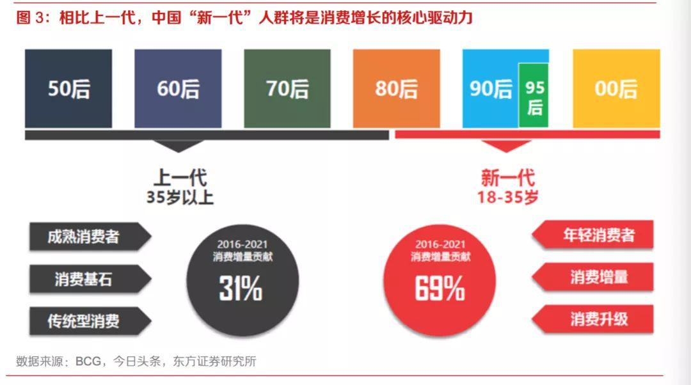

## Z世代消费：年轻人还需要信用卡么?  

> 发布: 洪偌馨  
> 发布日期: 2019-12-06  

编者按：本文来自微信公众号“[馨金融](https://mp.weixin.qq.com/s/RGXyi3PzMMPbiPUHLxsxkQ)”（ID：Xinfinance），作者 洪偌馨，36氪经授权发布。

>  _信用卡不只要满足消费需求，更需要构建一套价值观、品牌观。_

信用卡业务正在成为银行在金融科技时代最大的机会，但也面临着最严峻的挑战。

央行数据显示，信用卡全行业发卡量季度环比增速在2017年四季度触顶后开始一路下跌，到今年一季度降至0.63%的最低点。与此同时，行业资产规模增长也呈现放缓趋势。

而在增长疲软背后，行业整肃、监管收紧是一方面影响因素，但更重要的是，许多银行似乎对于整个产业发展逻辑的转变有些无所适从。过去几年，关于消费的一切都在改变，而这些改变的核心是「人」的改变。

眼下，消费新世代崛起，超过2亿的90后用户正在成为消费领域的主力军，小红书、B站、抖音、拼多多……谁能抓住新一代的消费者，谁就在占据了消费市场的未来。

然而这群生于数字时代的年轻人，他们从太早之前就在习惯超前消费，就能够从互联网获得帮助他们满足消费需求的金融工具。

信用卡还有机会吗？

###  **消费新世代崛起**

年轻人正在成为消费世界的「主宰」。

根据CEIC数据，中国私人消费占GDP的比重从2010年的35.6%增长至2018年的39.4%，消费已经接替投资成为了拉动经济增长的新引擎。而在这个消费升级和扩容的市场当中，「泛Z世代」人群正在成为消费增长的核心动力。

根据美国社会学家威廉.斯特劳斯和尼尔.赫伊的定义，所谓的世代是 **「因处于同一历史坐标而享有集体人格面具」** 的人群集体，世代长度大约等于一个生命阶段，世代界限则取决于同时代背景 （经济发展及技术进步）的行为模式和价值观。

参考欧美，通常以15 年为一个世代周期，中国则将1950-1964年间出生的人口称为建国一代，1965 年-1979 年间出生的人口为 X 世代，1980-1994 年间出生的人为Y世代，1995-2009 年间出生的人为Z世代。 _（注：由于90后与95后成长的环境极为相似，所以本文将90后统称为泛Z时代）_

2010年全国人口普查数据显示，中国的90后人口数量约为1.88亿。而根据教育部学校规划建设发展中心的数据，我国90后总量多达2.3亿人，这就意味着平均每6个中国人中就有一个90后。

从消费潜力上来看，东方证券在一份报告中提到，90后刚迈入而立之年，进入事业的黄金期，收入提升明显、消费潜力巨大，正在成为消费的主力军。

95后也逐渐步入职场，或通过实习、兼职等方式开始获得经济来源。00后尽管收入主要来自父母，但伴随着第一批00后进入大学，他们也开始自主掌握一定的经济支配权。

根据 2018 淘宝数据报告显示，90后成交金额超出80后近1/4，已然成为线上消费主力。WIFIPIX 在其发布的《轻奢消费人群分析报告》中指出，90后也在成为轻奢消费的主力军。

招行信用卡的一组数据也可以佐证，以其2019年10月末流通户为样本， **申卡年龄小于30岁的用户占比达到66.38%，总数近4000万；目前的6000万持卡人中，90后及00后的占比近40%。**

具体来看，招行信用卡2019年的数据显示，90后持卡人（有独立经济来源的非学生群体）的消费总支出增长了30%。对比来看，同一时期，80后持卡人增长了12%，70后持卡人增长了10%。

相比70、80后，泛Z世代成长于中国经济腾飞的黄金年代，物质环境优越、社会环境开放。再加上移动支付、网上购物、社交软件等新技术和新商业的发展，让这些互联网「原住民」展现出了更强劲的消费能力。

###  **Z世代消费图鉴  **

不同于以往几代人的成长环境和商业环境让「泛Z世代」显现出了截然不同的消费观和价值观。精致穷、颜值控、兴价比 _（注：兴是兴趣、价是价格）_ 、社交化.....

例如，今年这季奇葩说中出现了一个热度极高的辩题：年纪轻轻精致穷，我错了吗？这个看似不太和谐的组合词就被认为是「泛Z世代」中一个极具代表性的消费理念。

在百度百科上，关于「精致穷」的解释是：精致穷形容一种普遍发生在年轻人群体中的生活方式。虽然赚的不多，但并没有因此而放弃追求精致，为了自己所向往的生活和喜欢的东西变穷，穷的明明白白，也活得开心闪亮。

注重「精致」又带出了另一个「泛Z世代」身上显著的标签——颜值控。

招行信用卡统计用户办卡的驱动因素中， **喜欢卡面一直是最具辨识度的要素之一，** 尤其在已有一张信用卡的情况下，被「颜值」吸引而办卡的人数占比居高不下。所以，持续推出不同设计风格和理念的卡面也成为信用卡吸引用户的重要手段。

当然，这一现象不止出现在信用卡行业内。

多份关于90后消费行为的报告揭示了同样的趋势，在服饰消费中，90后将款式因素排在最优先的位置。甚至在汽车这样的大金额消费品方面，49%的90后购车群体更加追求外观和样式。

此外，如果是关乎自己的「颜值」，他们的消费欲望则更加直接而强烈。此前QuestMobile发布的《2019颜值经济洞察报告》显示，19-24岁的年轻群体在医美行业整体用户中占比最高。

美妆领域更加明显地呈现低龄化趋势，95后、00后群体的消费力持续上升。唯品会数据显示，2018 年，70后在美妆消费上的增长率为55%，80后的增长率是90%，90后的增幅为202%，95后的增长率更是高达347%。

除此之外，泛Z世代在消费习惯中追求社交化、个性化、便捷化，在消费理念上注重 **「兴价比」** 等特质也极为突出且大大有别于70或80后。

「兴价比」是招行信用卡通过对泛Z世代的消费数据分析重新定义的一套符合这个群体的消费观体系。这两个词看似对立，实则折射出的是「泛Z世代」对于物质和精神追求同样看重。

招行信用卡认为， **年轻人对商品的兴趣与商品本身价格的比，是反映商品可买程度的一种量化方式。在不同场景下，兴趣和价格都可能成为某一种商品被购买的关键决策因素。**

事实上，对应美国来看也是如此。

美国的Z世代（1995—2010出生的人）同样是互联网原住民，他们生长于社会经济保持中低速发展的一段时间，物质富足、社会稳定，所以这代人物质欲望不如父辈强烈，更强调个性化、注重个人价值的实现。

而伴随着消费升级，没有经济压力的泛Z世代普遍具有超前消费的意识，和较高的消费偏好。

融360此前发布的调查问卷统计数据显示：使用消费贷款用于日常生活消费的90后人群超过五成，占比50.17%。来自艾媒咨询数据显示，2018年中国90后短期消费贷款规模超3万亿，约占总规模三分之一。

###  **信用卡的「危与机」**

新一代消费群体和消费偏好的形成也给消费金融市场带来了新的机遇与挑战。

当场景、消费与移动支付等融合迸发出了强劲的生命力。先是产品端，花呗、白条等各类互联网分期产品层出不穷，它们在某种程度上成为了信用卡的替代品，甚至比有些信用卡体验更好、额度更高。

如果只满足消费属性，这些互联网上的原住民们还有动力去使用信用卡吗？

答案显然是否定的。

所以，我们可以看到，信用卡产品正在努力通过提供更多 **「增值服务」** 来吸引新的客群，同时提升存量客户的忠诚度和活跃度。以招行信用卡为例，针对快速崛起的Z世代用户，在满足其消费需求之外，提供了更多权益激励。

例如，招行信用卡在用户洞察研究中发现，30 岁以下的年轻人中80%都时刻注重身材管理，70%的都有定期学习习惯。他们更加注重生活中的亲历感,更在意自我价值的提升。所以，近年来招行信用卡的权益中就新增了包括兑换演唱会等演出门票、视频或在线教育的年费等等。

与此同时，招行信用卡还通过掌上生活APP打破了有卡与无卡线上与线下、金融与生活的界限，这更符合泛Z时代的生活习惯和消费方式——需要触手可及的服务。

此外，伴随着信用社会的建立，越来越多的年轻人也意识到 **积累信用的重要性** 。

毕业生的第一张信用卡是迈入成年人的标志之一，也是建立个人信用的开始。与互联网消费金融产品有所不同的是，信用卡是可以伴随用户成长的——额度可以增加、信用可以积累，进而「兑换」其它银行服务，比如房贷、车贷等。

长期来看，尽管互联网消费金融产品在效率和体验上表现优异，但受限于产品定位，额度空间有限。且这类产品目标客群大都「圈层固化」，比如，初入社会的毕业生，蓝领、白领等，没有办法伴随用户需求的增长而给予充分的满足。

所以，近年来也可以看到即便是针对年轻人的信用卡产品类型也变得越来越丰富。

例如，招行信用卡刚刚推出了针对泛Z世代「星座守护卡」和「自由人生白金卡」。以前者为例，为了紧扣「守护」这个主题，招行信用卡为持卡人提供一份健康险产品守护宝作为权益。

而另一款自由人生白金卡则是业内首个提供旅行、音乐、运动、生活等年轻人高频应用的权益,试图将物质和精神的充裕有机连接。

作为消费金融市场的主力军之一，信用卡如何在实现消费功能之外，构建自己的价值观也显得格外重要。

（封面图片来自Pexels）
