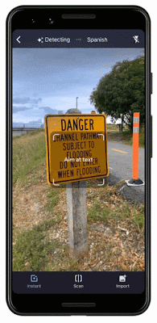

## Jeff Dean再执笔：一文看尽2019谷歌AI重大突破  

> 原创  
> Jeff Dean  
> 发布: AI前线  
> 发布日期: 2020-01-10  

作者 | Jeff Dean  译者 | 核子可乐、李冬梅、钰莹  策划 | Tina  **AI 前线导读：** 对于谷歌的研究团队来说，2019 年是令人兴奋的一年。Google Research 通过多种方式推动技术研究工作，包括基础计算机科学研究成果和出版物，以及多项研究被应用在谷歌的新兴领域（如医疗保健和机器人）、开源软件贡献，以及与谷歌产品团队的密切合作，所有这些都旨在提供有用的工具和服务。接下来，我们将重点介绍谷歌研究院在 2019 年所做的一些工作。（文章配图及链接较多，建议查看原文，便于理解）

**更多优质内容请关注微信公众号“AI 前线”（ID：ai-front）**

谷歌研究院的使命在于解决各类长期存在且意义重大的难题，借此为人们的日常生活带来巨大助益与便利。2019 年，为了继续实现这一目标，我们在广泛的基础研究领域取得了多项进展，包括着手将研究成果应用于医疗保健与机器人等新兴领域、开源大量代码，并继续与谷歌产品团队合作，共同打造用户喜闻乐见的各类工具与服务。

2020 年已经到来，我想我们有必要对过去一年中做出的研究加以回顾，并展望未来几年内需要进一步解决的问题。本着这种思路，我们希望通过本文对谷歌研究人员以及工程师们在 2019 年期间做出的重点研究工作进行一番梳理。

合乎道德的 AI 技术使用方式

2018 年，我们发布了一组 AI 原则，旨在建立一整套用于对产品内机器学习等技术进行评估的框架。2019 年 6 月，我们发布了另一项重要更新，希望说明如何在研究与产品的开发生命周期之内将这些原则付诸实践。由于该原则涉及 AI 与机器学习研究社区当中更为广泛的多个活跃领域（例如机器学习系统中的偏见、安全性、公平性、问责制、透明度以及隐私性等），因此我们希望能够利用各个领域中最先进的技术，同时结合我们的研究成果以显著推动与之相关的技术创新。

例如，这一年中，我们：

* 发布了一篇关于透明性工具的研究论文，这款工具负责为我们的多种云 AI 产品提供 Model Cards。我们还在文中展示了一种面向云 AI 视觉 API 对象检测功能的 Model Card 示例。

相关链接：https://research.google/pubs/pub48120/

* 展示了 Activation Atlasses 如何帮助探索神经网络行为，并提升机器学习模型的可解释性。

* 发布了 TensorFlow Pirvacy，这是一套开源代码库，用于在机器学习模型训练当中引入差异性隐私保障机制。

* 公布公平性指标 Fairness Indicators 的 beta 版，希望帮助机器学习从业者们发现机器学习模型当中存在的不公平或者意外影响因素。

在 Fairness Indicators 当中点击对应柱形部分，即可在 What-If Tool 中查看该部分的全部相关数据点。在上图的示例中，为显示所有带有“female”标签的数据点。

* 在 KDD’19 上，发表关于如何将成对比较与正则化合并至大规模生产推荐系统当中，从而提高机器学习公平性的论文。

* 在 AIES’19 上发表一篇论文，主要探讨如何在机器学习研究中保障生产分类系统的公平性，同时描述了我们所采用的公平性指标——即条件平等，主要强调机会均等前提下的分布差异。

* 在 AIES’19 上发表论文，探讨如何在文本分类中保证与事实相左的公平性。论文提出这样一个问题：“如果示例中引用的敏感属性发生变化，那么预测结果会受到怎样的影响？”以此为基础，我们希望改进在线不良内容审核的生产系统。

* 发布新的数据集，用于帮助识别 deepfakes 伪造内容。

AI 技术的社会福祉

机器学习在解决各类重要社会问题方面具有巨大的潜力。我们也一直在这个领域展开探索，致力于帮助人们利用机器学习的创造力与技术成果解决更多问题。洪水是地球上最常见也最致命的自然灾害，每年影响约 2.5 亿人口。我们一直在利用机器学习、计算以及质量更高的数据源做出更准确的洪水预报，而后将可行的警报发送至受灾地区全体居民的手机端。我们还召开了一个研讨会，邀请众多在洪水预报、水文学以及机器学习等方面掌握专业知识的研究人员汇聚在一起，与谷歌共同讨论在洪水预防与治理这个重要问题上的进一步合作可能。

除了洪水预报工作之外，我们还一直在开发技术以更好地了解世界上的各类野生动植物。我们目前与七个野生动植物保护组织开展合作，利用机器学习技术帮助分析摄像机拍下的野生动植物数据；与美国国家海洋大气局合作，帮助他们从视频中发现不同的鲸鱼种类以及录制到的水下声音。我们还创建并发布了一整套工具，以机器学习为基础实现更多新型生物多样性研究。

作为第六届精细视觉分类研讨会上的一部分，来自加纳阿克拉的谷歌研究人员与马凯雷雷大学 AI 及数据科学研究小组的成员们开展合作，共同发起了一场关于木薯类植物病变分类的 Kaggle 竞赛。木薯是非洲第二大碳水化合物来源，因此此类植物的健康事关非洲的食品安全。我们很高兴看到来自 87 支队伍的超过 100 名参赛者加入这场竞逐。

2019 年，我们还更新了谷歌地球 Timelapse，让人们能够更高效且直观以观察地球在过去 35 年中的变化情况。此外，我们还一直与学术研究人员合作，希望利用新的隐私保护方法整理关于人类流动性的数据，进而为城市规划者提供降低碳排放水平、提高环境利用效率的参考性信息。

我们还利用机器学习强化儿童教育。联合国认为，目前全球仍有 6.17 亿儿童没有基本的识字能力，而这将直接决定其未来的生活质量。为了帮助更多孩子学会阅读，我们的 Bolo 应用采用语音识别技术，可实时为学生提供指导。为了降低使用门槛，我们对应用进行了优化，确保其能够在低端手机上以离线方式运行。在印度，Bolo 已经帮助 80 万儿童阅读故事并跟读 10 亿个单词。早期结果令人鼓舞：在印度 200 个村庄进行为期 3 个月的试点之后，参与者中阅读能力提高的比例达到 64%。

对于年龄较大的学生，Socratic 应用程序可以帮助高中生们解决数学、物理以及 1000 多个与学科教育相关的复杂问题。这款应用可根据照片与口头提问自动识别出题目中涉及的基本概念，并链接至最合适的在线资源。与苏格拉底的教育模式类似，Socratic 应用不会直接回答问题，而是引导学生自主发现答案。我们很高兴能够通过 Bolo 与 Socratic 等方案，推动全球范围内的教育质量提升。

此外，我们决定由 Google.org 向优胜方提供 2500 万美元赠款。社会反响巨大，我们收到来自 119 个国家的 2600 多份经过认真规划的提案。最终，20 个组织凭借其解决重大社会与环境问题的潜力脱颖而出，成为我们的第一批受赠者。下面一起了解他们带来的卓越方案：

* 无国界医生基金会（MSF）希望开发一款免费的智能手机应用，利用图像识别工具帮助资源分管地区的临床工作人员（目前在约旦地区进行试验）分析抗微生物图像，并在适当时提出抗生素使用建议以解决特定患者的感染问题。

* 目前，仍有超过 10 亿人口以散户形式从事农业劳作。一场虫害侵袭就会毁掉全部农作物乃至他们的生计。Wadhwani AI 利用图像分类模型对害虫进行识别，进而提出与农药选择以及喷洒时机相关的建议，最终帮助农户提高作物产量。

* 在热带雨林深处，非法砍伐一直是影响气候变化的重要因素。Rainforest      Connection 利用深度学习进行生物声音监测，同时支持利用淘汰掉的陈旧手机跟踪热带雨林健康状况并检测出威胁活动。

AI 技术在其他领域的应用，同样是我们高度关注的重点方向。我们已经通过多方协作发表了大量论文，2019 年的重要成果包括：

* 在《对苍蝇大脑进行交互式自动 3D 重建》论文中，我们开发出一套机器学习模型，并通过其中的各个神经元映射并跟踪苍蝇大脑的完整结构。

论文地址：https://ai.googleblog.com/2019/08/an-interactive-automated-3d.html

* 在《探索更好的偏微分方程（PDE）的模拟方法》中，我们展示了如何利用机器学习加速 PDE 计算，从而为气候科学、流体力学、电磁学、热传导以及多种其他一般性基础计算问题带来效率提升。

论文地址：https://ai.googleblog.com/2019/07/learning-better-simulation-methods-for.html

* 我们通过《嗅觉学习：利用深度学习预测分子的气味特性》对自然界中的气味因素进行了探究。我们展示了如何利用图神经网络（GNN）直接预测单一分子的气味描述符，全程无需引入任何人为规则。

论文地址：https://ai.googleblog.com/2019/10/learning-to-smell-using-deep-learning.html

* 能够将化学与强化学习技术相结合，我们提出了一套分子优化框架。

* 机器学习还能够帮助我们在艺术与创作领域取得突破。艺术家们发现将 AI 与 AR 相结合以创造出新型作品形式的方法，包括机器舞蹈、舞蹈编排、利用机器学习工具创作新的旋律等。如今，即使新手也能轻松使用机器学习技术。为了纪念 J.S. 巴赫，我们开发出一款由机器学习技术支持的即兴乐谱生成工具：只要创作出旋律，该工具就能够按照巴赫的风格制作相匹配的和声。

辅助技术

机器学习能够为我们的日常生活提供更为个性化的辅助。观看美丽的图像、聆听喜爱的歌曲或者与亲朋好友交谈，都是我们生活中必不可少的组成部分。但是，要将十几亿人联系起来，单凭这种直观对接显然无法实现。机器学习技术能够将这些视觉、听觉以及语音信号转换为其他信号，并在统一的管理之下改善人们对于周遭环境的访问能力。我们在这一年中推出的辅助技术包括：

* Lookout，帮助失明或者视力低下的用户识别周围信息。其采用与 Google Lens 类似的基础技术，允许我们将手机指向四周以搜索目标物体并与之互动。
* Live Transcribe，有望帮助聋哑或者听力障碍人士在日常交流中更加独立便捷。即使对方使用的是他国语言，用户也可以即时将内容转录并翻译为易于理解的形式。

* Project Euphonia，负责进行个性化语音到文本转录。对于患有 ALS 以及其他可能导致器具不清或发音不准问题的用户，这项研究提供的自动语音识别（ASR）模型的实际效果上远超以及同类方案。

* 与 Project Euphonia 类似， Parrotron 利用端到端神经网络帮助用户改善交流，但主要针对语音到语音自动转换（而非转录）。Parrotron 提供语音接口，方便更多用户轻松使用。

* 目前，互联网上存在数百万张未加文字说明的图像。谷歌提供的图像描述可以帮助盲人或者弱视用户理解这些无标记图像。当屏幕阅读器发现没有配套描述的图像或者图形时，Chrome 浏览器现在可以自动创建相关说明。

* 我们开发出 Les for Google Go，这是一款以音频形式读取可视文本的工具，能够帮助那些识字不多的用户较为顺畅地理解文本所表达的内容。

让手机更智能

我们的大部分工作，在于通过机器学习技术为手机提供更多新功能，真正让个人设备实现智能化提升。通过开发出可在手机上运行的强大模型，我们得以保证各类常规手机功能拥有更强的响应能力，甚至可在飞行模式或者断风情况下正常使用。目前，我们已经开发出能够运行在手机上的准确语音识别模型、视觉模型以及手写识别模型，这也为后续更多强大新功能的出现铺平了道路。2019 年，我们实现的重要成果包括：

* 利用 Live Caption 实现手机自动字幕生成功能，可始终为设备上播放的全部视频提供转录字幕。

* 开发出功能强大的 Recorder 新型转录应用，可帮助用户索引音频信息并直接检索音频内容。

* 改进谷歌翻译中的拍照翻译功能，我们可以指向文本当中看不懂的特定部分，系统会结合上下文立即进行翻译。

* 发布 ARCore 中的 Augmented Faces API，让更多新的实时 AR 自表示工具成为可能。

* 演示了设备上的实时手部跟踪功能，为用户提供手势交互以及设备控制的全新方式。

* 改进基于 RNN 的屏幕软键盘手写识别效果。

* 发布一种利用智能手机摄像头实现的全球导航方法，可帮助用户更准确地定位当前所在位置，让我们轻松找到前往目的地的道路。

联合学习是谷歌研究人员在 2015 年发明的一种强大机器学习方法。在它的帮助下，众多客户（例如个人用户乃至企业整体）可以协同训练模型，同时保持训练数据的分散性。如此一来，我们就能在大规模学习系统中有效保护隐私属性。如今，我们正越来越多地在自有产品及功能当中使用联合学习，同时也在努力推动这一领域中众多研究工作的发展。2019 年，谷歌研究人员与来自 24 个学术机构的学者们合作，共同撰写了一篇关于联合学习的论文，重点介绍了过去几年中这项技术的进展以及当前仍然存在的开放性研究问题。

相关链接：https://arxiv.org/abs/1912.04977

过去几年，计算影像的进步使得智能手机的图像质量取得了巨大进步，2019 年当然也不例外。这一年中，我们让自拍效果更上一层楼，提供专业级别的景深图像处理功能，同时也在 Pixel Phone 上通过 Night Sight 功能让拍摄天文照片成为可能。关于这方面工作的更多技术细节，请参阅我们的《在极弱光条件下进行多帧超分辨率及移动摄影》的论文。我们的工作只有一个目的——帮助大家拍下漂亮的照片，纪念生活中的每一个神奇瞬间。

健康

2018 年末，我们将谷歌研究院健康团队、Deepmind Health 以及谷歌硬件部门的一支队伍（专注于与健康相关的应用）合并起来，组成了 Google Health。2019 年，我们继续推进这一领域中的研究，与多家医疗合作伙伴发表了研究论文并开发出多款工具。下面来看过去一年中的相关亮点：

* 我们发现，利用深度学习模型分析乳房 X 光片，能够帮助医生发现乳腺癌病变。在美国，有八分之一的女性或早或晚将受到这种疾病的影响，而深度学习模型的诊断准确性高于人类专家，且误报与漏报比例更低。无论是在对美国某地患者的检测，还是对英国医院提供的脱敏数据进行分析，这套模型都带来了类似的准确率改善。

通过机器学习正确识别出人类难以发现的癌症病例

* 我们证明，利用深度学习模型进行皮肤疾病诊断，其准确率要高于初级医师，甚至相当或者略好于皮肤病理学家。

* 通过 Google Health、DeepMind Health 以及美国退伍军人事务部（VA）专家的联手合作，机器学习模型被证明在预测急性肾操作（AKI）疾病的发作方面表现突出。提前两天发现问题，能够有效避免患者因此遭受的折磨。未来，医生有望提前 48 小时着手处理这类严重疾病。

* 我们与多家合作伙伴组织将深度学习技术引入电子健康记录系统。

* 我们在预测肺癌方面获得了可喜的进步。在这项早期研究中，我们尝试利用一种深度学习模型检查单项 CT 扫描结果，其诊断能力与放射科医师基本相当，有时甚至更高。事实证明，早期发现肺癌能够大大提高患者的生存几率。

* 我们与 Verily 以及来自印度及泰国的医疗合作伙伴联手，继续扩大部署并评估我们用于检测及预防眼科疾病的机器学习工具。

* 我们发表了一篇关于利用增强现实显微镜诊断癌症的研究论文，病理学家能够在通过该显微镜检查组织的同时，获取载玻片上其他重要信息的实时反馈。

* 我们为病理学家构建起以人为本的相似图像搜索工具，允许他们通过检查类似病例以做出更加高效的诊断。

量子计算

2019 年，我们的量子计算团队首次实现了“量子霸权”，即量子计算机在执行某项任务时，表现出远超世界上最强经典计算机的执行速度。二者的成绩对比为 1 万年对 200 秒。

左图：艺术家描绘的低温恒温器内 Sycamore 处理器。右图：Sycamore 处理器实拍照。

量子计算机在材料科学、量子化学以及大规模优化等领域中将发挥重要作用，但要真正实现目标，我们必须进一步推动技术发展。目前，我们的关注重点主要放在量子误差校正方面，这是为了进一步延长量子计算系统的运行时间。我们还在努力简化量子算法的表达，改善硬件控制难度，同时也找到了利用经典机器学习技术（例如深度强化学习）构建高可靠性量子处理器的方法。2019 年的成就令人振奋，我们相信这一切都将为量子计算的广泛应用奠定坚定的基础。

通用算法与理论

在通用算法与理论方面，我们继续延着算法基础与应用的方向前进，同时也对图挖掘等方面进行了一番探索。

我们在 VLDB 19 上发表了一篇题为《面向数据中心应用程序的缓存感知负载均衡》的论文，看起来好像有点晦涩，再来个平易近人般的标题，《通过妙招将数据中心的服务容量提高 40%！》。论文介绍了我们如何利用图的均衡分区对 Web 搜索后端服务系统中的缓存进行指定，从而将闪存驱动器的查询吞吐量提高了 48%，并最终将后端整体搜索吞吐量提高 40%。

相关链接：http://www.vldb.org/pvldb/vol12/p709-archer.pdf

跨 Web 搜索服务页的 Flash   IO 请求（由缓存未命中引起）热图。三个驼峰分别代表随机叶选择、负载均衡以及缓存感知负载均衡（从左至右）。各线条表示第 50、90、95 以及 99.9 百分位。VLDB 19 论文，《面向数据中心应用程序的缓存感知型负载均衡》

在 ICLR 2019 上发表的一篇题为《新瓶装旧酒：强化学习发现经典优化算法》的论文中，我们发现了算法与机器学习之间的新联系，展示了强化学习如何为几个经典的在线优化组合问题（例如在线匹配与分配）高效找到最佳、最差以及统一算法。

相关链接：https://openreview.net/pdf?id=rkluJ2R9KQ

我们在可伸缩算法方面的工作主要涉及大数据集的并行、在线与分布式算法。在 FOCS 19 的最新论文当中，我们为互连组件找到了近乎最佳的大规模并行计算算法。我们的另一组论文则改进了用于匹配（包括理论与实践两方面）与密度聚类的并行算法。第三项工作则是在黑盒模型中实现子模函数的自适应优化，这类模型在特征选择以及词汇压缩等场景中具有多种应用。在 SODA 19 的论文中，我们提出一种在三大方面近乎最优的亚模算法，包括逼近因子、舍入复杂度以及查询复杂度。在 FOCS 2019 的另一篇论文中，我们为 PCA 及列子集选择提供了一种在线乘法近似算法。

相关链接：https://arxiv.org/abs/1910.05385

在其他工作中，我们引入了半在线计算模型，该模型假定未知的未来场景中包含可预测部分与对抗部分。在经典的组合问题方面，例如二分匹配（ITCS 19）与缓存（SODA 20），我们发现的半在线算法能够在最佳在线与离线算法之间完成顺畅插值。

我们最近在市场算法领域的研究，主要包括对学习与市场间相互作用的最新理解，以及实验设计层面的多项创新。例如，NeurIPS 19 上发表的口头论文就展示了战略型代理在常规重复性双方博弈中相较于学习型代理的惊人竞争优势。近期，对于广告自动化的关注也引起我们对自动竞价以及广告主响应行为分析的浓厚兴趣。在 WINE 2019 在两篇论文中，我们研究了最大限度提升广告主转化率的最佳策略，并进一步分析了广告主对于竞价过程中各类变化的响应行为。最后，我们在保留干扰因素的前提下进行了实验设计研究，发现一组成交可能影响到另一组的结果。在 KDD 19 论文与 NeurIPS 19 论文当中，我们则展示了如何定义单位或单位簇，旨在限制干扰并保持实验能力。

相关链接：http://papers.nips.cc/paper/8436-strategizing-against-no-regret-learners

KDD 19 论文《通过地理聚类进行随机化实验设计》中提出的聚类算法，适用于对美国本土进行用户调查。该算法能够自动识别各大城市群，包括正确预测出湾区所涵盖的旧金山、伯克利以及帕洛阿尔托，且不包括萨克拉门托。

机器学习算法

2019 年，我们在机器学习算法与方法中的多个不同领域进行了研究。其中的一大重点，在于了解神经网络中的训练动态性质。在博文《测量神经网络的数据并行训练极限》当中，谷歌研究人员提供了一组严谨的实验结果，表明对数据并行水平的缩放（增加批量规模）能够提高模型的收敛效率（利用数据并行方法）。

相关链接：https://ai.googleblog.com/2019/03/measuring-limits-of-data-parallel.html

在测试的所有工作负载当中，我们观察到批量大小与训练速度之间存在三大通行关系：小批量对应完美伸缩（沿虚线），批量增加最终导致收益递减（非虚线），最大批量时数据并行度最高（趋势平稳）。在不同工作负载之间，过渡点往往具有很大的差异。

与将数据分布在多台计算设备中的数据并行方法相比，模型并行的扩展效果更好。GPipe 是一套采用类似于流水线式 CPU 处理器方法的库，能够显著提高模型并行化效率：当整个模型中只有一部分在处理某些数据时，则其他部分可着手处理其他数据。这种流水线方法得出的结果能够再次组合，从而模拟出规模更大的批量任务。

事实证明，机器学习模型能够获取原始输入数据并学习其对应的高级表示形式，这些表示形式最终可用于区分某些重要属性以及类别（例如猫、卡车、牛、癌症组织与正常组织等）。目前，提升机器学习算法的重点就在于鼓励其发掘这些高级表示形式，从而将学习到的能力推广到更多新的示例、问题或者领域当中。2019 年，我们结合以下几个背景对此展开研究：

* 在《评估无纠缠表示形式的无监督学习》论文中，我们探讨了哪些属性会影响到无监督学习中的表示形式，希望借此理解哪些因素能够成就更好的表示与学习效果。
* 在《预测深度神经网络中的泛化差距》论文中，我们发现可以使用边际分布的统计量来预测泛化差距（即模型利用训练分布数据得出的性能，与利用具有不同分布的实际数据得出的性能之间，存在的具体差距），帮助我们更好地了解哪些模型具有更好的泛化效果。我们还进行了一系列关于在机器学习模型中改善分布失调检测能力的研究，希望更好地了解模型从何时开始接纳从未见过的各种数据。我们还在强化学习背景之下研究了非策略分类，希望进一步了解哪些模型可被用于概括出最佳模型。

* 在《从稀疏与未指定奖励中学习归纳》论文中，我们研究了指定奖励函数以实现强化学习的方法，旨在使学习系统能够更直接地从真实目标中学习，且不会因时间周期过长、动作序列不当等因素造成与预期不符的结果。

在这项指令跟随任务中，动作轨迹 a1、a2 与 a3 达成了目标，但序列 a2 与 a3 并没有正确跟随指令。这说明其中存在奖励不足问题。

AutoML

这一年中，我们继续推进 AutoML 方面的工作，旨在探索如何利用学习算法提升机器学习的整体自动化程度，同时确保某些类型的机器学习元决策能够带来比顶尖人类机器学习专家更出色的实际结果。具体包括：

* 在《EfficientNet：通过 AutoML 与模型绽放提高准确率与效率》论文中，我们展示了如何利用神经架构搜索技术在计算机视觉问题中获得质量显著提升的结果，即在 ImageNet 上的成绩相当于最高准确率的 84.4%，且使用参数只相当于原有最佳模型的八分之一。
* 模型大小与准确率比较。EfficientNet-B0 是由 AutoML MNAS 开发出的基准网络，而 Efficient-B1 到 B7 则是由该基准网络扩展而来。具体来看，EfficientNet-B7 在 ImageNet 上的成绩相当于最高准确率的 84.4%，第五高准确率的 97.1%，但参数仅相当于现有最佳 CNN 的 1/8.4。

* 在《EfficientNet-EdgeTPU：利用 AutoML 创建加速器优化型神经网络》论文中，我们展示了神经架构搜索方法如何找到最适合特定硬件加速器的高效模型，从而生成可在移动设备上运行的高精度、低计算量模型。

* 在《视频架构搜索》论文中，我们阐述了如何将 AutoML 工作扩展到视频模型领域，如何找到可实现最佳结果的架构，以及如何在使用 50 倍分辨率的情况下达成与手调模型性能相近但计算量更低的架构。

TinvVideoNet（TVN）架构一直在不断演变，希望在最大限度提高识别性能的同时，将计算时间保持在必要限制之内。例如，TVN-1（上方）在 CPU 上需要运行 37 毫秒，在 GPU 上运行 10 毫秒。而 TVN-2（下方）在 CPU 上运行 65 毫秒，在 GPU 上运行 13 毫秒。

* 我们还开发出可用于处理表格数据的 AutoML 技术，帮助众多企业与组织在关系数据库内发掘出新的重要数据价值，并希望基于此类数据开发新的机器学习模型。我们将这项合作开发技术以 Google Cloud AutoML Tables 的名称发布，同时讨论了该系统在 KaggleDays 表格数据端到端 AutoML 解决方案竞赛中的表现。（剧透：在与 74 支由专家组成的数据科学团队进行一番比较之后，AutoML  Tables 排名第二。）
* 在《神经网络的中立权重探索》论文中，我们展示了如何在无需训练步骤的前提下，更新神经网络架构以调整评估模型中的权重。通过这种方式，架构搜索的计算效率得到了显著提升。

* 《将 AutoML 应用于 Transformer 架构》论文探索了如何为自然语言处理任务寻找最佳架构，目标是在显著提高原始 Transformer 模型性能的同时，大大降低计算成本。

* 在《SpecAugment：一种用于自动语音识别的新型数据增强方法》论文中，我们证明自动学习数据增强方法完全可以扩展至语音识别模型当中。与依赖于人类机器学习专家的现有数据增强方案相比，这种学习增强方案能够显著提升准确率水平。
* 我们还启动了第一款利用 AutoML 实现关键字识别与口语识别的语音应用。在实验当中，我们发现这类模型在经过一段时间的运行之后，在效率与性能方面都优于人工设计的模型。

自然语言理解

过去几年，自然语言理解、翻译、自然对话、语音识别和相关任务的模型取得了显著进展。今年，我们工作的一个主题是通过结合模式或任务来提高自然语言理解技术水平，来培训更强大和性能更优的模型。举几个例子:

* 在探索大规模多语言、大规模神经机器翻译的过程中，我们通过训练一个模型在 100 种语言之间进行翻译，而不是使用 100 个单独的模型来进行训练，因此翻译质量得到了显著提高。

* 在具有流端到端模型的大规模多语言语音识别中，我们展示了如何将语音识别和语言模型结合起来，在多种语言上训练系统，可以显著提高语音识别的准确性。

* 《翻译：端到端的“从语音到语音”的翻译模型》，我们展示了可以训练联合模型来实现语音识别任务（通常是单独的任务），翻译效果和语音生成效果都表现良好，就像在生成的翻译音频中保留了说话者的声音一样，还可以训练一个简单的整体学习系统。

* 在《用于语义检索的多语言通用句子编码器》中，我们展示了如何结合许多不同的目标来产生在语义检索方面表现更好的模型（相对于简单的单词匹配技术）。例如，在 Google Talk to Books 中，“什么味道能唤起回忆?”最终得到的结果，“对我来说，茉莉花的香味和烤盘的香味，让我想起了我无忧无虑的童年。”

* 在《稳健神经机器翻译》中，我们展示了如何使用对抗性训练程序来显著提高语言翻译的质量和稳健性。

机器感知

过去十年，用于更好地理解静止图像的机器感知模型取得了显著进步。这些模型和方法的下一步任务就是要更好地详细了解动态世界。这包括对图像和视频更深入，更细致地解读，以及对生活和环境的感知：以交互的速率以及与用户共享的空间基础来理解视听世界。今年，我们在该领域的许多方面取得了进展，包括：

* Lens 中更精细的视觉理解，可实现更强大的 视觉搜索。
* Nest Hub Max 上有用的智能相机功能，例如快速手势，面部匹配和智能视频通话取景。

* 实时和空间感知感知技术，通过使用 Lens 能帮助我们开拓周围的世界。

* 更好的 视频深度预测 模型。

* 使用时间周期一致性学习对视频进行细致地理解的更好的表现形式。

* 学习文本、语音和与未标记视频在时间上一致的视频的表示形式。

* 能够通过对过去的观察来预测未来的视觉输入。
* 模型可以更好地理解视频中的动作序列，使用户能够更好地回忆特殊的视频时刻，如谷歌照片中的“吹蜡烛”或“滑下滑梯”。我们能不断改善对周围感官世界的认知，这样我们感到兴奋。

机器人

机器学习在机器人控制中的应用是一个重要的研究领域。我们相信，这是一个使机器人能够有效地在复杂的、现实世界的环境中（例如家中或办公场所中）运行的至关重要的工具。我们今年的工作包括:

* 在《自动强化学习远程机器人导航》中，我们展示了如何将强化学习与远程规划相结合，使机器人能够更有效地在复杂环境中导航（比如谷歌办公大楼）。

* 在《PlaNet：一个用于强化学习的深度规划网络》中，我们展示了如何从图像的像素中有效地学习一个世界模型，以及如何利用这个世界模型来完成更少学习片段的任务。

* 在《将物理学和深度学习与 TossingBot 相结合》中，我们展示了机器人如何通过在环境中进行实验来学习“直觉”物理学，而不是通过预先编程的物理模型来了解它们所处的环境。

* 在《Soft Actor-Critic：深强化学习机器人》中，我们展示了将强化深度学习算法训练到最佳期望奖励（标准 RL 目标）以及最大化 Policy 信息熵（这样学习支持 Policy 时更随机），可以帮助机器人更快地学习并在环境的变化中变得更稳健。

* 在《学习自我监督反汇编中进行组装和泛化》中，我们展示了机器人如何通过学习以自我监督的方式对事物进行分解然后学会组装。孩子们可以从拆分过程中学到知识，机器人似乎也可以。

* 我们引入了 ROBEL（低成本机器人学习 Benchmark），这是一个成本效益机器人开源平台，提供精准 Benchmark，旨在促进现实中物理机器人硬件的研究和开发。

推进更广泛的开发者和研究者社区

开源不仅仅与代码相关，也与贡献者社区相关。今年是开源社区激动人心的一年，我们发布了 TensorFlow 2.0，迄今为止最大的 TensorFlow 版本，这使得构建 ML 系统和应用程序比以往任何时候都要容易。我们在 TensorFlow Lite 中增加了对快速移动 GPU 推理的支持。我们还推出了 Teachable Machine 2.0，这是一个快速、简单的基于网络的工具，只需点击一个按钮就可以训练一个机器学习模型，不需要编码。我们发布了 MLIR，这是一种开源的机器学习编译器基础结构，可解决不断增长的软件和硬件碎片的复杂性，并使构建 AI 应用程序更加容易。

* 我们见证了 JAX 的第一年，这是一个用于高性能机器学习研究的新系统。在 NeurIPS 2019 上，谷歌和更多开源社区展示了 JAX 涉及了哪些工作，从神经切线内核到贝叶斯推理到分子动力学都有 JAX 的参与，我们在云 TPUs 上发布了 JAX 的预览。

* 我们开源了 MediaPipe 和 XNNPACK，MediaPipe 是用于构建感知和多模式应用 ML 管道的框架，一个有效的浮点神经网络推理运算符库。截至 2019 年底，我们已使全球 1500 多名研究人员能够通过 TensorFlow Research Cloud 免费访问 Cloud TPU。我们在 Coursera 的 TensorFlow 简介吸引了 10 万名学生。我们与成千上万的用户互动，同时将 TensorFlow 带到 11 个不同的国家和地区，并举办了我们的第一个 TensorFlow World 等。

* 在 TensorFlow 的帮助下，一名大学生发现了两个新行星，并建立了一种帮助其他人发现更多行星的方法。最初来自尼日利亚的一位数据科学家训练了 GAN 来生成让人联想起非洲面具的图像。乌干达的一位开发者利用 TensorFlow 开发了一款名为“农民伙伴”的应用程序，当地农民可以用它来对付破坏农作物的毛虫。在多雪的爱荷华州，研究人员和州政府官员使用 TensorFlow 根据交通行为、图像和其他数据来确定安全的道路状况。在阳光明媚的加利福尼亚，大学生们用 TensorFlow 软件来识别洛杉矶的坑坑洼洼和危险的道路裂缝。在法国，一位程序员使用 TensorFlow 建立了一个简单的算法，学习如何为黑白照片添加颜色。

开放数据集

带着明确、可评估目标去开放数据集可有效地推进机器学习的发展。为了帮助研究社区发现有趣的数据集，我们继续使用 Google 数据集搜索来索引来自不同组织的各种开放数据集。我们认为创建新的数据集对社区探索和开发新技术十分重要，我们也有责任共享开放数据集。今年，我们还发布了多个不同领域的开放数据集:

* Open Images V5：它是 Open Images 数据集的更新，其中包括 350 个分类中的 280 万个目标的分割蒙版（因此，它现在具有约 900 万个带有图像级标签，目标边界框，目标分割蒙版和视觉关系的图像 ）。

* 自然问题：第一个使用自然查询并通过阅读整页信息而不是从段落中提取答案来回答问题的数据集。

* Deepfake 检测数据集：我们为 FaceForensics benchmark（如上所述）贡献了一个大型的可视化 Deepfake 数据集。

* Google Research Football：一个新颖的强化学习环境，代理旨在掌握足球这一世界上最受欢迎的运动。对于强化学习代理来说，拥有 GOOOAAALLLSS 很重要。

* Google-Landmarks-v2：超过 200 万个不同地标的 500 万张图像（是第一版的 2 倍）。

* YouTube-8M Segments：大规模分类和时间本地化数据集，其中包括经过人工验证的 YouTube-8M 视频的 5 秒细分级别的标签。

* 原子视觉动作（AVA）口语活动：一种多模态的视听视频数据集，用于感知对话。此外，AVA 动作识别和 AVA：口语活动也 面临学术挑战。

* PAWS 和 PAWS-X：为帮助解释短语，两个数据集都包含格式良好的句子对，这些句子对具有较高的词法重叠，其中约有一半句子对有释义，一半没有。

* 自然语言对话数据集：CCPE 和 Taskmaster-1 都使用 Oz 向导平台，该平台将两个参与口语对话的人配对，以模拟与数字助理的人际对话。

* 可视任务适应性基准测试：VTAB 遵循与 ImageNet 和 GLUE 相似的指导原则，但基于一个原则——一种更好的表示形式是，在域内数据有限的情况下，对不可见的任务上产生更好的性能。

* 模式指导的对话数据集：它是针对对话的最大的公开可用语料库，涵盖 17 个领域的 18000 多个对话。

研究社区互动

总而言之，我们一直深耕于更广范围的学术和研究社区。2019 年，谷歌研究人员发表了数百篇论文，参加了许多会议并获得了诸多奖项和荣誉。我们在以下方面取得了喜人的成就：

* CVPR：约 250 名谷歌员工贡献了 40+ 论文、演讲、海报、研讨会等。

* ICML：约 200 名谷歌员工贡献了 100+ 论文、演讲、海报、研讨会等。

* ICLR：约 200 名谷歌员工贡献了 60+ 论文、演讲、海报、研讨会等。

* ACL：约 100 位谷歌员工贡献了 40+ 论文、研讨会和教程。

* INTERSPEECH：100 多名员工贡献了 30+ 论文。

* ICCV：大约 200 位谷歌员工贡献了 40+ 论文，还有几位谷歌员工还获得了三个业内颇具声望的 ICCV 奖项。

* NeurIPS：约 500 名谷歌员工共同撰写了 120 多篇被广泛认可的论文，并参加了各种研讨会等等。

我们还会将来自全球各地的数百名谷歌研究人员和教职人员召集到在谷歌总部举办的 15 个独立研讨会上。这些研讨会的主题包括：改善全球洪灾预报、如何使用机器学习来构建可以更好地为残疾人服务的系统，以及加速用于噪声中级规模量子（NISQ）处理器的算法、应用程序和工具的开发。

为了支持除谷歌之外的其他学术界和研究社区，我们通过年度博士奖学金计划为全球 50 余名博士研究生提供了支持。在 2018 年谷歌院系研究奖中，我们资助了 158 个项目，并且举办了“谷歌人工智能驻留项目”第三届会议。我们也那些以致力于发展人工智能的初创企业提供支持。

新环境、新征程

2019 年我们取得了长足的进步，但我们在很多方面能做得更好。为了继续扩大我们在世界的影响力，我们 在班加罗尔 开设了一个 研究办公室，并且我们正在扩展其他办公室。

展望 2020 · 走向更远的未来

过去的十年，机器学习和计算机科学得到了突飞猛进的发展，现在我们已经能让计算机来更好地看见、听见并理解人类语言。现在，我们有了可以使用从事复杂计算的设备，这些技术和设备可以更好地帮助我们完成日常生活中的许多任务。通过开发专用硬件，我们已经围绕这些机器学习方法重新设计了计算平台，从而能帮助我们解决更多更大的难题。这改变了我们对数据中心（例如，以推理为中心的 TPUv1 和以训练和推理为中心的 TPUv2 和 TPUv3）以及低功耗移动环境（例如 Edge TPU）中的计算设备的认知。深度学习革命将重塑我们对计算和计算机的认知。

欣喜之余，我们也意识到在过去一年仍然存在大量未解决的问题。下列这些问题我们需要在 2020 年和以后更好地去解决：

* 我们如何构建可以处理数百万个任务并能成功自动学习新任务的机器学习系统？目前，我们主要是针对每项新任务从零开始来训练单独的机器模型，哪怕最好的也不过是从一项或多项高度相关的任务开始训练模型。因此，我们训练的模型能够擅长做一件事或几件事，但不擅长做训练之外的其他任何事情。但是，我们真正想要的是一种善于利用其专业知识来完成很多任务的模型，这样这些模型就能够以相对较少的训练数据和计算来学习做新任务。现阶段来说这是个非常大的挑战，因为它需要联动多个专业领域，包括固态电路设计、计算机体系结构、以 ML 为重点的编译器、分布式系统、机器学习算法等。还需要与多个领域的专家交互来构建泛化地、能够在整个应用领域独立解决新任务的系统。

* 我们如何在人工智能的重要领域推进最新技术，例如避免偏见，增加可解释性和可理解性，改善隐私和确保安全？随着我们在社会上越来越多地使用机器学习，这些领域的进步将变得至关重要。

* 我们如何应用计算和机器学习在重要的新科学领域取得进步？通过与气候科学、医疗保健、生物信息学和许多其他领域的其他领域的专家合作，可以取得重要的进步。

* 我们如何确保机器学习和计算机科学研究领域所追求的思想和方向具有多样性？ 计算机科学和机器学习研究社区所做的工作对数十亿人意义重大，我们希望从事这一工作的研究者能够表达出世界上所有人们观点、关注、创造和热情，也就是说从业者要具有多样性。我们如何以最佳方式去支持来自不同背景的新研究人员进入该领域？

总体而言，对于谷歌和更多研究社区来说，2019 年是令人振奋的一年。我们已经做好充足准备来迎接 2020 年及未来的挑战，我们也期待与公众分享我们的进步！

原文链接：

https://ai.googleblog.com/2020/01/google-research-looking-back-at-2019.html

