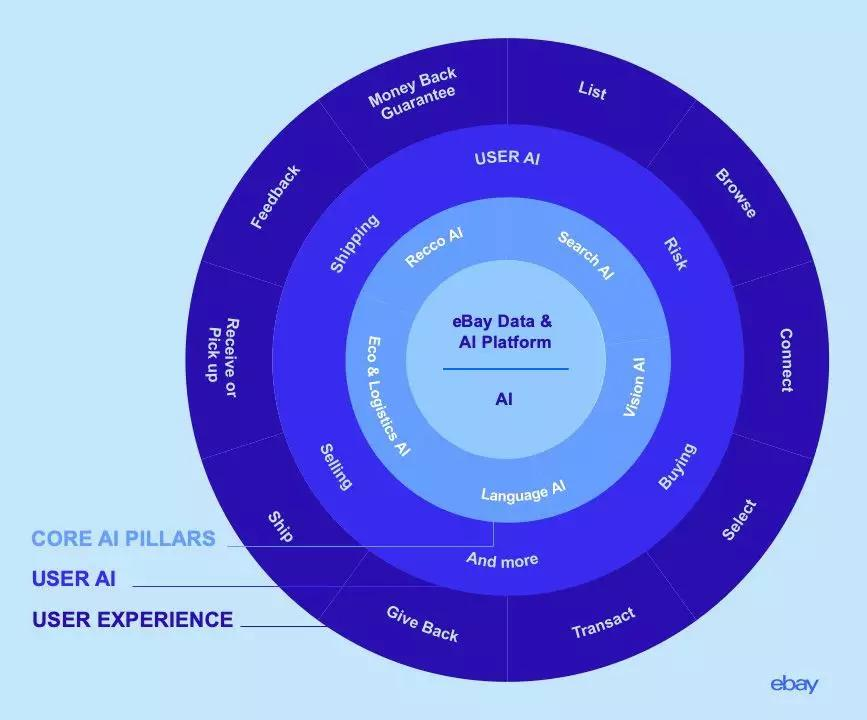
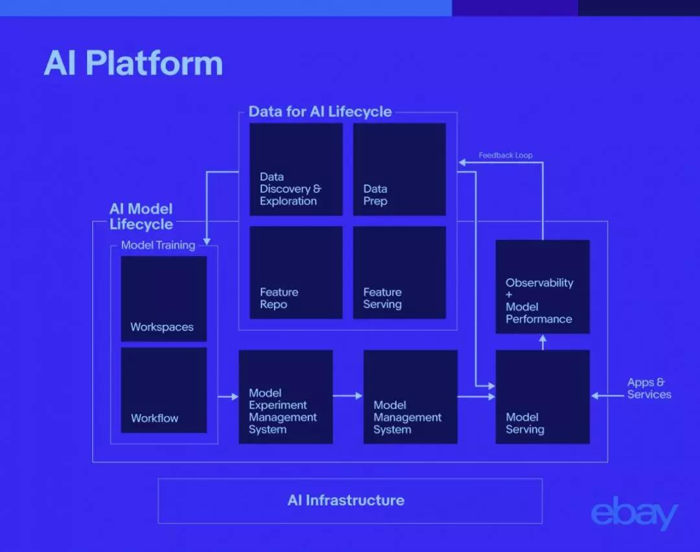
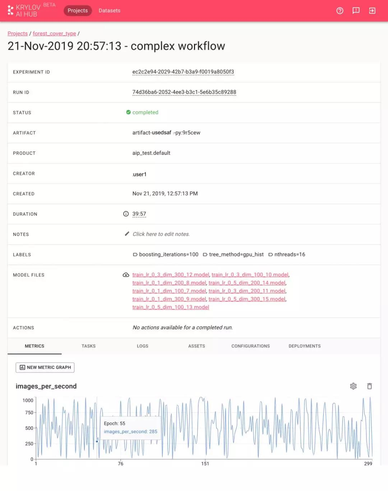
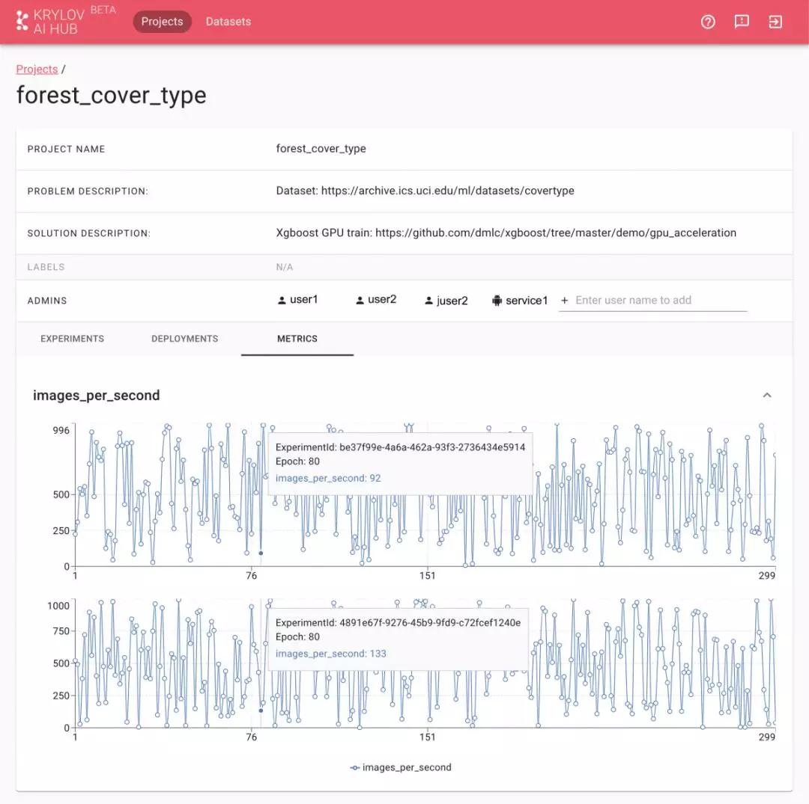
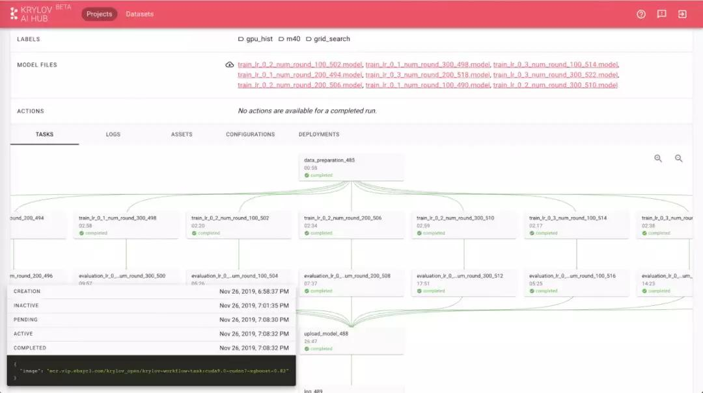

## 开发部署时间从几个月到几分钟：eBay的大规模AI平台实践  

> 原创：  
> AI前线小组 译  
> 发布: AI前线  
> 发布日期: 2020-01-06  

作者 | Sanjeev Katariya，Ashok Ramani  译者 | 小大非  编辑 | 蔡芳芳  
 
**AI 前线导读：** 本文将介绍 eBay 的人工智能转型是如何通过一个统一开放的现代化人工智能平台实现的。

本文最初发布于 eBay 技术博客，由 InfoQ 中文站翻译并分享。

你是否曾经想要找一件物品，却难以用语言来描述它？现在，有了 eBay 的现代化人工智能平台提供的计算机视觉功能，这项技术可以帮助你根据你点击的照片或图像找到物品。用户可以进入 eBay 应用程序，拍下他们正在寻找的东西的照片，只需要几毫秒，平台就会显示出与图像匹配的物品。用户不仅触发了计算机视觉技术，还利用了一些先进的人工智能功能，包括深度学习、分布式训练和推理。该计算机视觉算法对 5 亿多张图片和 eBay 的 14 亿份清单进行筛选，找到在视觉上相似的最相关的清单。

eBay 之所以能够实现如此有效的、大规模的、精确的人工智能，一个主要原因是 Krylov——eBay 最先进的现代化人工智能平台，其目标是提高 eBay 的人工智能生产率，并加速大规模人工智能模型的上市时间。

人工智能平台正对所有行业的领军企业产生了巨大的影响。像谷歌这样的公有云提供商使用人工智能平台提供了许多产品和服务。Facebook 的人工智能平台名为 FBLearner Flow，可以对新闻源进行个性化处理，并过滤掉攻击性内容。在 Uber，机器学习平台米开朗基罗（Michelangelo）提供了一种能力，让顾客能够准确预测他们通过 UberEats 点的餐何时送达。

类似地，eBay 从头开始构建了 Krylov，目标是将其作为一个可伸缩的、多租户的、基于云的 人工智能平台，以支持各种规模的人工智能用例。仅在 2019 年，eBay 的数据科学家每月就使用 Krylov 运行数千个模型训练试验，这些试验涵盖了各种人工智能用例，如计算机视觉、自然语言处理（NLP）、销售规划建议、买方个性化服务、卖方价格指导、风险、信任、运输估计等等。

图 1 eBay 的 AI 策略 从几个月到几分钟

在 Krylov 之前，数据科学家需要几周甚至几个月的时间来建立一个具备生产力的模型。他们需要采购和管理基础设施，将数据转移到机器上，并安装框架——有时还会遇到问题，带来额外的生产管理费用。在大型数据集上训练模型不能跨节点伸缩。

现在，人工智能云上的基础设施可以按需使用，数据科学家可以访问最新的软件、硬件、模型和运行时，如 Notebooks、TensorFlow、PyTorch 和 H20。通过这些运行时，我们可以对 BERT（用于语言理解）或 ResNet（用于计算机视觉）等模型在我们的 14 亿库存清单上进行大规模的训练。

数据科学家可以使用分布式训练在大数据集上训练模型。他们可以同时进行试验和超参数调整，记录和可视化试验，并部署最好的模型试验。例如，我们的人工智能研究人员使用 Krylov 来训练神经机器翻译模型、用于推荐系统的深度和广度模型，以及用于增强图像搜索的计算机视觉模型。这是提高模型精度和缩短 eBay 机器翻译技术上市时间的关键。机器翻译技术对实现跨境贸易贡献巨大，占 eBay 国际收入的 59%。

Krylov 允许我们的人工智能团队最大限度地利用 eBay 拥有的海量数据，包括批量数据和实时数据。如果将数据看作是人工智能和机器学习的燃料，那么 Krylov 就是由这种燃料驱动的复杂的交通工具。

这是一种快速发展的交通工具。如今，数据科学家可以在不到一分钟的时间内，通过流行的软件框架（TensorFlow、Scikit Learn、数学库、Jupyter Notebooks 等）在自己选择的计算配置（GPU、高内存多核心）上构建一个 AI 工作空间。以前，这个过程可能需要几天。

数据科学家还可以使用 Python、Java 或 Scala 接口运行自动化 AI 工作流（管道），以试验各种方法（超参数），并记录他们的试验及比较试验的输出。在大型数据集和模型上进行超参数调优和运行分布式训练的能力显著提高了模型的准确性。

为了更好地管理系统中传输的大量数据，eBay 设计并构建了自己的 专用服务器。新的服务器可以让 eBay 的数据科学家和工程师加速开发新功能，将开发时间从几周减少到几个小时。

在业务影响方面，部署时间有巨大的改善。eBay 现在可以将模型训练自动化，并将模型部署到个性化或通用推理平台上，只需几天，而以前需要几个月。这导致了一些重要功能的改进，比如 图像搜索，它允许购物者通过上传相似商品的图片来浏览他们想要的商品。

建立统一的人工智能平台团队

Krylov 是高度创新的，它的开发方式也是如此。

eBay 的统一平台需要跨不同的用例集，比如计算机视觉、自然语言处理（NLP）和推荐系统。因此，开发人员和数据科学家有各种各样的需求。这是一个为期多年的平台转型。实现 Krylov 是一项打破各种竖井并跨职能和地理区域开发和执行统一愿景的实践。

为了领导该项目，我们组建了统一人工智能计划核心团队（ICT）。ICT 包括来自 AI 平台团队的代表（该团队是服务的提供者）、平台的所有者和构建者。此外，人工智能平台还依赖于硬件、计算、网络、存储和数据服务。

ICT 的第三个组成部分是 AI 领域团队，即平台的内部客户，例如广告、计算机视觉、NLP、风险、信任和营销等方面的 AI 研究和工程。对于日常的 AI 生命周期管理，这些人工智能团队已经从定义、实现和采用这个平台获益。

这些专家一起为 eBay 创建了一个统一的 AI 愿景，包括平台的战略、路线图和关键原则。这是一个实践过程。在不同的地方，来自领域团队的研究人员和工程师会以内部开源的方式参与到平台某些部分的构建。因为这些工程师和研究人员更接近领域问题（AI 生命周期），或者在过去已经为他们的特定需求构建了框架 / 平台，所以他们能够提供关键的输入。在某些情况下，有些框架和平台被纳入了“统一 AI 平台”，因为它们很好地解决了一个特定的问题，并有助于加速平台向更广泛的 eBay AI 社区的发展。

此外，我们还设立了一个 eBay 机器学习（ML）工程奖学金项目，任何在 eBay 的工程师都可以加入到人工智能平台团队中，类似于一个实习项目，帮助构建产品待办列表中的平台特性。这个奖学金项目的目的是让 eBay 工程师熟悉 ML 的概念和技术。参与者会获得来自资深领域专家的关于 ML 工程概念的指导。

内部开源模型和 ML 工程奖学金项目不仅有助于代码贡献，而且也在我们扩展我们的科学家和工程师的技能集时，作为平台开发的反馈机制。

了解痛点

在构建 Krylov 的探索阶段，为了更好地理解构建 eBay 人工智能的难点和挑战，跨不同地理位置的 eBay 全球团队协同工作。这包括理解需求和希望；对人工智能研究人员和开发人员的日常生活表示理解和感激；并研究行业中现有的方法。

分阶段构建、采用和转换人工智能的多年时间里，需要：

* 通过强大的计算能力（GPU、高内存多核心）轻松、安全、高效地访问数据的人工智能训练集群；
* 训练平台：可自动训练工作流及交互式工作空间、SDK、客户端（Python、Java、Scala、REST）；
* AI 模型生命周期管理：模型试验管理、模型管理服务、部署服务、AI Hub（基于 Web 的 UI）
* 模型服务平台和反馈循环：将 AI 模型作为服务绑定到试验框架和监控系统（操作以及模型性能）实现部署；
* 用于建模、部署和推断由数据发现、准备、特性存储和服务以及反馈循环组成的生命周期的数据生命周期抽象；
* 此外，该平台必须建立与几个关键的原则，以解决 eBay 不同数据科学家和工程团队的人工智能用例和操作模式。我们确立的主要原则有：
* 支持异构软件框架——Tensorflow、PyTorch、Cafe、Notebook 以及任何选用的框架；
* 异构硬件架构——支持 GPU、高内存 CPU；
* 支持大规模；
* 以开源的方式使用开源技术。

图 2 使用 AI 平台进行端到端的 AI 模型生命周期管理

图 3 AI Hub（用于模型端到端生命周期管理的 UI）显示了在 AI 项目中与合作者进行的模型训练试验

图 4 AI Hub 显示了一个 AI 项目中两个模型训练试验之间的指标对比

图 5 AI Hub 显示了一个 ML 模型训练工作流（DAG）的可视化，在这里用户可以看到状态以及工作流中每个任务的更多细节。用户还可以附加日志和资产、指定配置和查看部署状态。

平台建成后，我们将为 AI ICT 团队提供预览、Alpha 和 Beta 访问，让他们提前访问并测试平台。这种迭代式的、具有统一愿景和执行力的协作帮助 eBay AI 社区为自己构建了一个统一的平台。

虽然早期的结果取得了成功，但这并不意味着我们已经完成了全部工作。人工智能是一场没有终点的进化之旅。展望未来，我们将通过 eBay 的人工智能托管市场继续创新之路，我们也会继续分享我们的发现。

**原文链接：**

https://tech.ebayinc.com/engineering/ebays-transformation-to-a-modern-ai-platform/
