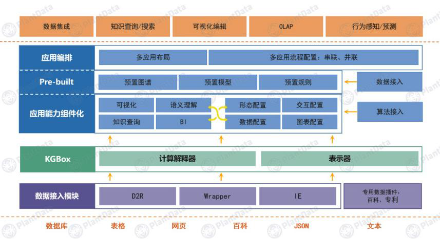

## 「PlantData」研发认知智能中台，为行业提供知识图谱全生命周期解决方案  

> 发布: 小豆包  
> 发布日期: 2020-01-16  

人工智能已经在“听、说、看”等感知领域取得了比较大的突破，但是在逻辑推理、知识迁移的认知智能领域方面还处于非常早期的阶段。知识图谱作为实现机器人认知智能的底层技术，能够帮助机器更好地理解数据，进行高精度的知识提炼，并且通过知识挖掘、推理、可视化分析等手段，更好地解释现象，辅助人类的决策分析。

知识图谱的应用可以分为两大方向。一类是通用知识图谱，以谷歌、百度、必应、搜狗为代表；另一类是行业知识图谱，例如早在2015年就已经估值超200亿美金的Palantir，面向国防公安领域，还有面向能源领域的美国公司MAANA。 **由于人工智能在落地的过程中，需要拥有对业务全流程Know-How的认知，知识图谱起到了很关键的作用。**

在构建知识图谱的过程中，可以利用平台解决企业多源异构数据难以融合、数据模式动态变迁困难、非结构化数据价值难以挖掘，数据难以统一消费等问题，降低了行业知识图谱落地门槛。但在工程落地方面，还存在图谱建设周期长，应用构建专业程度高，跨行业迁移成本高等难题。由此带来的挑战会体现在——产品是否可以开箱即用，是否有相关行业的schema可以借鉴，多源异构数据梳理高成本如何解决，用户是否可以自助式构建应用等方面。

为了解决以上问题，PlantData提出了将知识图谱构建与应用平台升级为认知智能中台。

**PlantData成立于2017年，目前业务主要面向军工和金融领域。** PlantData结合用户业务场景需求搭配产品组件，通过几十种配适器方便用户将数据快速转换到知识图谱中，实现知识建模、知识获取、知识融合、知识存储、知识计算、知识应用的 **知识图谱全生命周期解决方案** 。

在降低企业大数据向知识转化的成本方面，PlantData通过组件微服务化，模型&数据模式预构建、业务编排等方式形成 **开箱即用的体系结构** ，并且帮助用户提高数据库梳理效率、同时支持 **自助式构建应用** ，提高企业数字化转型的效率。

此外，在知识图谱存储环节，PlantData没有用行业普遍采取的图数据库，而是自研了 **混合存储引擎** 来强化系统的分析性能，并且与图数据库相比具备更好的扩展性。引擎支持高效存储图形类、文档类、 记录类等各种类型的数据，同时拥有数据语义消费和图结构消费两方面的特性。

基于知识图谱的认知智能中台

PlantData围绕知识图谱认知智能中台已经形成产品体系，包括：知识图谱全生命周期管理平台（KGMS）、智能问答机器人（KGBot）、知识图谱自动化构建平台（KGBuilder）、企业级智能助手（KGAssist）、智能文本抽取平台（KGText）以及轻量级构建产品（KGLite）。目前已积累40家左右的行业标杆用户，以大型央企、国企为主，客单价百万级，包括中国电科、中航工业、中船重工、中航联创、国家电网、中信建投、中国银行、华为、新华社等。也与软通动力、国电南瑞、蓝凌等建立了渠道合作关系。

PlantData创始人丁军告诉36氪，目前客户基本可分为三大类：第一类是自身有一定开发能力的客户，第二类是有纯产品采购需求的客户或集成商；第三类是需要提供定制化的端到端服务的客户。前两类客户是主要客源，公司以出售标准化产品为主。

PlantData团队60人左右，主要为研发人员。36氪了解到，其核心团队在语义网及知识图谱领域有超过十年的研发经验，公司提出知识图谱全生命周期管理的方法论是在2017年CCKS（全国知识图谱与语义计算大会）上。PlantData透露，2019年营收已达数千万，2020年预计将以3倍速度增长。PlantData在2017年12月获松禾资本投资的1000万元天使轮，2019年6月完成动平衡资本和中航联创的1500万元Pre A轮融资，2019年12月已完成盛宇投资的数千万元A1轮融资。
