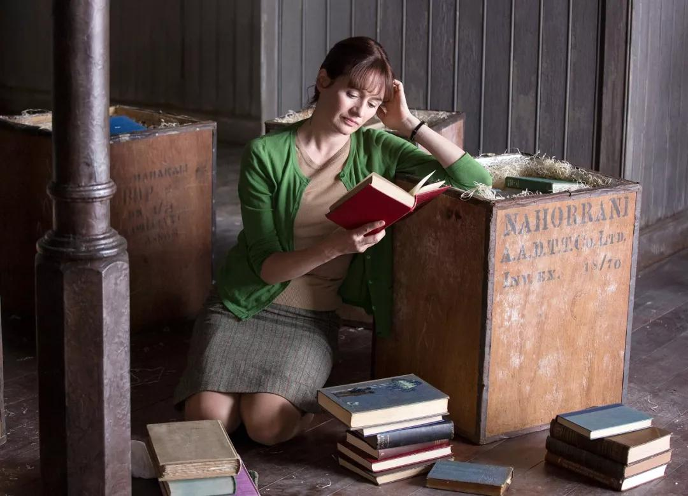
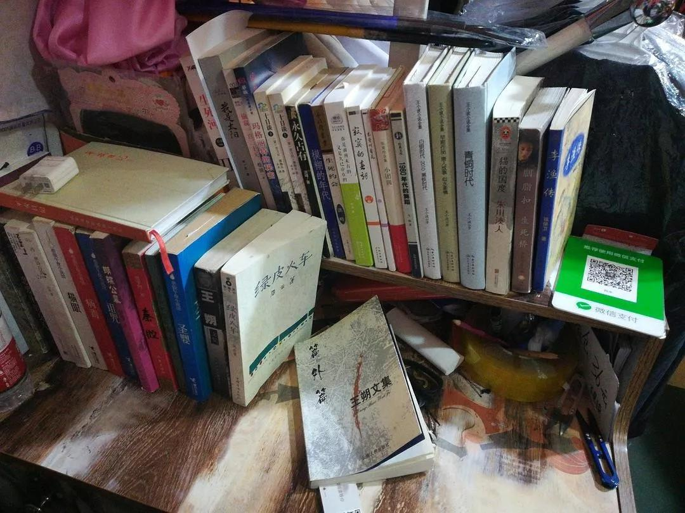
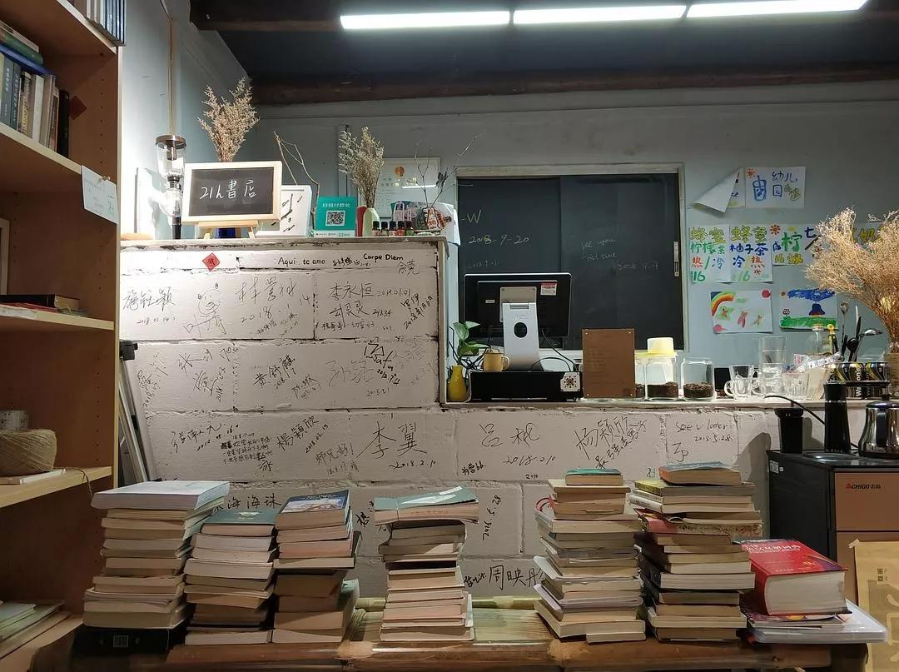
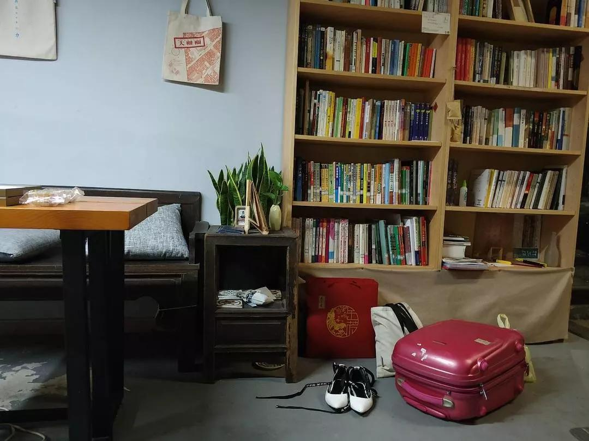
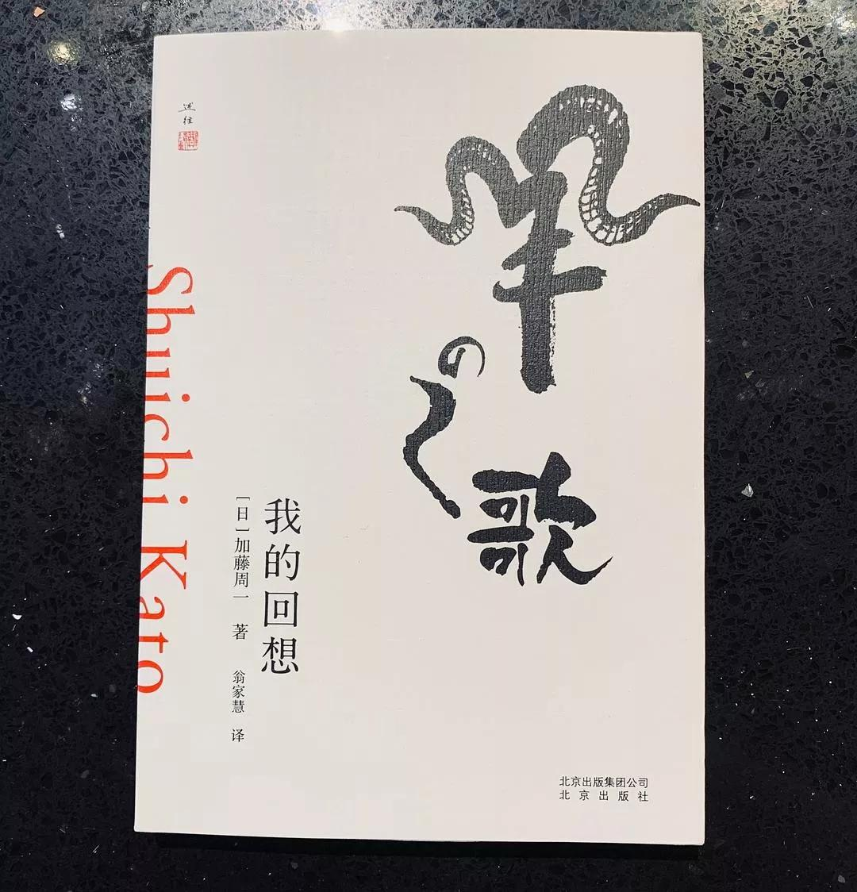
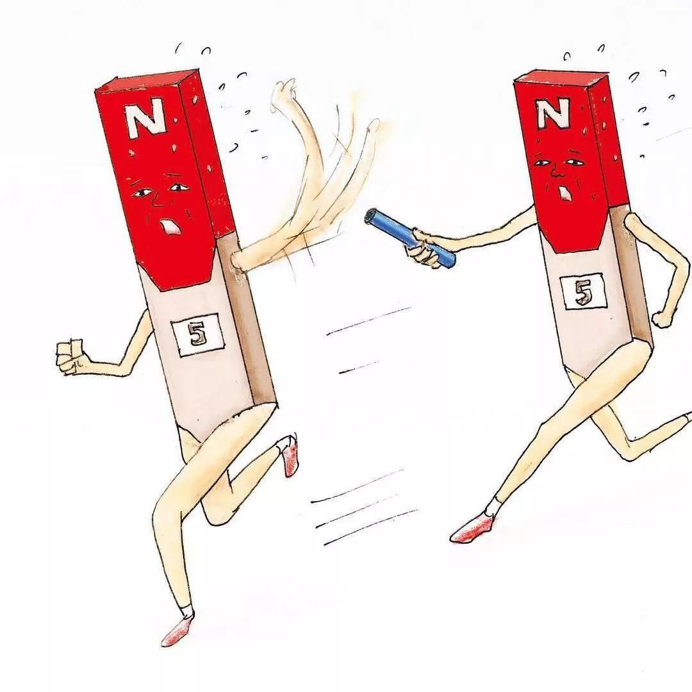

## “书永远都有新的，我却只有一辈子”  

> 原创  
> 理想君  
> 发布: 理想国imaginist  
> 发布日期: 2020-01-16  

前段时间，理想国在线上发起“书之痛”（读书人的扎心时刻）话题活动，大家的参与出乎预料。微博1200万阅读，成了豆瓣热点话题，阅读130万。
理想君不忍心看着不错的留言和故事淹没，整理出来，分享给大家。或许，你在这些喜怒哀乐里头能找到诸多共鸣。

**01** **@亥尔旺 ：**买书两万块。卖书三千元。

**02** **@晨曦英雄 ：**我很喜欢读书人，当他们搬家时，每看到一箱书，我都会很高兴跟他说：“搬这个得加钱。”

**03** **@迟与缓 ：**“你平时喜欢做什么？”“看书。”“哦，那我以后可以找你要资源吗？”“……我看纸质书。”“哦，你好有钱啊！”“……”
“不是有个什么阅读器，专门用来看书吗？”“嗯。kindle的话我买了。”“那你干嘛还买纸质书？”“……我喜欢。”“喜欢看纸质书可以去图书馆吧，为什么要买呢？”“我乐意。”“那我以后可以找你借书吗？”“不可以。”
“你买这么多书看得完吗？”“每天看。”“你看这么多书有什么用？”“我高兴。”“你每天就宅着看书，什么活动都不参加，难怪一直单身。”“要你管。”“我看你书架上的书好像都是小说，大部分还是日本的，好像也不怎样，质量太低了，怎么不看些有深度有分量的书？”“……是我看书不是你看书。”

**04** **@七月 ：**和前男友买房后准备结婚的这一年，想着以后不用租房了于是拉出书单肆无忌惮地买买买，然后对方出轨，觉得十一年的感情真的舍不得，苟延残喘了半个月，还是不能忍，分手。上百本书只能打包进黑漆漆的纸箱放到朋友家，离家三百多公里，在想着怎么把他们搬回家，现在进退两难，无所适从，扎心。

**05** **@西米 ：**我是心怀作家梦开实体服装店的青年，收银台上除了二维码，放的都是最近读的书。顾客常常以为，我的店除了卖衣服，还卖书。还是不在意别人说什么吧。

**06** **@理想国 ： **“你们如果是要行骗，千万别找那些在生活中经受过打磨的人，你去骗那些读书人，读书人其实是最好骗的，有两滴眼泪掉的就把钱给你了。”（阎连科，《速求共眠》2019.3.3分享会 ）

**07** **@凌茗Yay ：**很烦这些情况，碰上了都很扎心：①一拿起书看马上有长辈说我在学习；②以为我看的都是“帮助学习”的书，对小说嗤之以鼻；③把上学说成“读书”，把学习说成“读书”（在我看来，上学、学习、读书这三个概念没什么必要联系，真对这些人对教育的认识感到失望）④碰到教师没收书籍的时候，而我的同学笑嘻嘻的、幸灾乐祸的交上一堆网络小说；（这些人就不会反抗吗！感觉他们完全是把读书当成是开玩笑的事儿）⑤藐视我从小从教科书接受的道德教育，等我长大后用所谓的“社会现实”的坏勾当骂我“读书读傻了”。

**08** **@朱岳 ：**我的一个作者也是年轻导演，我说你的书要是卖不完最后就只能化浆了。他说，太有意思了，到时我一定得去拍。

**09** **@大清国的猫托邦 ：**高考后，我把所有书打包回家，然后就出去跟朋友一起玩了一周。回来后发现，家人让小外甥过来挑书，把我的好多书都挑走了……

**10** **@默尔索 ：**我妈来到我的房间，看着已经满了的书柜对我说：你就整天都在搞这些？？有啥意思的？把心思放在寻寻觅觅上好过啦。我回了一个冷笑给她。

**11** **@丑娃阿轩 ：**书看的越多越找不到对象。成天看书，跟你都没有话聊。

**12** **@安夜的山居生活 ：**不该让你读那么多书，不然早就结婚生孩子了。

**13** **@以我明德 ：**看着么多书就不能斯文点，脾气好点嘛？

**14** **@艾荀 ：**因为学习或工作需要，我会买很多学术书籍，告诉自己“你得读这些书”。
买回来之后也有很努力地读。每一个字都进了眼睛，但就是不进脑子。一页要读上两三遍才能理解个大概“噢，原来讲的是这个。”但没多久又忘记了。
所以很羡慕那些学术理论信手拈来的人，理论结合实际对当下某些现象分析地十分透彻。我只在一旁瞪眼：他说的那本书我读了呀，写了这个内容吗？

毕业要到另一个城市工作。书多，大学期间几次搬宿舍已经给腰落下了毛病；便没有请搬家公司，和当时的男友一起把所有的东西都搬到了他宿舍。
分手后，千里迢迢赶回来收拾东西。好在我有一个开书店的朋友，便把一行李箱的书寄放在了他那里。不想再和书互相拖累，便下决心：如有人喜欢，可售。把每一本细细翻过，在每一本上贴标签给下一任主人留言。这千里托孤的滋味啊，再也不想经历了。
眨眼一年多过去了。不知道我那些宝贝书还剩多少。什么时候接他们回来呢？这份工作之后我会在哪里都还不知道呢。

**15** **@开膛手贝塔 ：**第一种人。读书约等于吃米其林。觉得看书神圣，非我辈能享用，于是不看、不查、不关注。
第二种人。读书约等于吃火锅。这个翻翻，那个看看，浅尝辄止，而且还要气氛做足，咖啡书店落地窗都是好调料。
第三种人。读书约等于喝奶茶。什么火看什么，哪个畅销买哪个，动不动就是好吗好的我不摸摸头，要不就是用自己喜欢的方式过一生。
第四种人。读书约等于吃快餐。觉得自己要看点书，但不知道看啥，那迷茫的表情就跟看麦当劳菜单的时候一模一样。
这几种人其实也不扎心，人家看自己的，跟咱没关系，谈不上扎心。
只不过我觉得书要是有心，他们倒是挺扎书的心。

**16** **@明修 ：**出差时和同事聊到阅读。他说”我十几岁那年痛哭一场，因为我终于意识到好书太多，这辈子都看不完。"

**17** **@阿蕖 ：**我：我想买书。。。众：不，你不想！（书：缺架。架：缺地儿。地：缺房。房：缺钱。钱：不多读点书想挣个锤子钱！）

**18** **@八月 ：**换灯管的师傅看到书架上有本《日本的未来》，冷笑道：哼，中国的未来都不知道还关心什么日本的未来。

**19** **@石头 ：**几年前和前女友吵架，因为这本书的书名和一个女性姓氏重叠，前女友奋而撕书，幸亏抢夺及时，没有撕成粉碎，当即决定和她分手。果然，分手没多久，她就结婚了，她显然不是我想找的那本书。

**20** **@^\_^@ ：**我和我朋友说我对婚姻没什么期待，觉得婚姻是一种枷锁，自由被缩小，还要处理各种亲戚关系。他说，谁让你看这么多书，被书毒害得不浅……

**30** **@蝠蝠 ：**最讨厌不爱护书的人，每次看到有人粗暴翻书，用刚沾了水的手摸书，而且还是我的书时，都会想冲过去戳他的眼睛……本来这本《羊之歌》是有书腰的，被一个大叔给当着我的面直接撕掉，但奈何他是我客户，又不能发作脾气，只能告诫自己以后要把新书放进自己的包里。

**31** **@坐以待币玥小饼 ：**书借给别人，拿回来封皮破了，仔细一看发现有不少折角的痕迹，有被水泡湿的，还有油点子……

**32** **@低俗小说家 ：**收到快递，
家属:“这是什么？”
我:“书……”
家属:“前几天买的看完了吗你就买新的？”
我:“那不一样。”
家属:“哪儿不一样？”
我:“……”
家属:“真是的！买了又不看，家里都是你的书……以后看完一本才能再买下一本，听到没！”
我:“谁说我没看？而是那都是不同类型的……”
家属:“翻了几页那叫看？”
我:“……”
家属:“这么些书我倒要看看你准备什么时候给它看完！”
我:“哦……”

**33** **@ZinK ：**我的书签，如果是放在客厅没有夹在书里，我父母就会用背面来记电话号码。
我亲眼看见我妈吃饭的时候，拿着我《百年孤独》里的书签看了又看，我刚想跟她讲讲这本书，接下来就看见，她把书签抻平喽，放在桌子上，把嘴里啃剩下的骨头吐在上面。

**34** **@笑叹词穷 ：**我只是想找个安静的地方看小说：
同学：“你天天去图书馆，去自习室，考试成绩也不是特别好啊”
我一次买了两三本小说带回宿舍：
室友：“你看不完”
\(我每一两个星期都去影院看次电影：同学：“你可真有钱！”\)

**35** **@Knight ：**当有人向你借书的时候，就要做好了把书送给对方的心理准备。因为往往一借无回。

**36** **@石头摇篮 ：**借出去的书还回来时，在你用铅笔做的标注或笔记旁，那人用水笔与你进行了全面探讨。实在无分歧之处，也会写上赞同、对、是的。

**37** **@枫枫lam ：**1.借出去的书再也回不来；
2.借出去的书回来时已面目全非；
3.借出去的书要求还时还被说小气；
4.借出去的书再三要求还回来时还被说应该送给他；
5.借出去的书…
从此，我明白了——喜欢的书不能借

**38** **@开膛手菲欧娜 ：**初三上晚自习的时候，我做完了作业，复习了该复习的。想要放松一下就开始看哈利波特，被班主任看到没收了，说期末再给我。中考完毕后，我去问老师要书，她轻描淡写的说“借”给另外一个同学看了。我跑去找那个同学，他说“落在家里了，回头还我。” 那个时候快递还没那么发达，他和我又不熟，我离开学校之后才发现我既没有他的QQ，也没有他的手机号。故事就结束在我自己又买了一本。但至今我想到这件事都有一种咬牙切齿的恨意。

**39** **@为 ：**是的，这是我现在大学宿舍的枕头边。北师大宿舍贼小，没有空位，上床下桌更是免谈。午夜梦回，总是被枕边摞得太高的书无情地活埋了我的大脑袋。
再不敢往宿舍买书了，不然迟早有一天真的为书殉情。于是开始成箱的往家里网购，委托一天天工作归来疲倦之极的老妈妈抬上二楼。

**40** **@ermit ：**网友推荐了台湾里仁书局的《金瓶梅词话》，在内地买特别贵，公司正好有一个台湾的同事每个季度都会回家一趟，想让她帮我带一套回来，结果被一脸鄙视。认真读过《金瓶梅》的人很多对这本书的评价都很高，我是真的想认真的去品读，咋就被想的那么猥琐呢。

**41** **@亲爱的爷爷奶奶：** \#扎心时刻1\#某邻居：读那么多书，不还是找不到好对象\!

\#扎心时刻2\#某领导：读那么多书，不还是没我赚得多\!
......
人认为的好与有用仅为读书反应在现实层面的某一个符号，认同还是否定，都会形成当下对一个人的判断，对于此刻这是一个短期效应。用辱骂或反感对方来想象长期，仅仅是痴人说梦。不要为三观不合的人扎心，毕竟那是自己的心。
人家仅是顺嘴一句话的事，如果是自己也这样认为，那则是流血飘橹。别让一场不同维度的战争成为一场对自己的杀戮！

**42** **@不说话 ：**花大价钱买来的收藏的书，被我妈十几块钱卖给了收废品的。

**43** **@蒙． ：**好不容易买的书绝版了都被家里人当废纸卖了

**44** **@sssummer ：**刚毕业的时候，工作面试侃侃而谈，轻松过关。可是那时候第一次上班 和同事相处的时候 总觉得自己有点力不从心 他们聊的内容我不了解 我喜欢的领域他们不涉及直到一天 我的同事告诉我 “你还是适合回去在象牙塔里读书！”

**45** **@Frusswilov ：**六年前在弯弯清华交换。同组有个学生物的小伙，当时已经保厦大了。同组讨论的时候，我觉得无聊，臭老九做派犯了，拿着pad读《后汉书》。这小伙半是不理解半是瞧不起地问我：你们读这个有什么用？成果能创造多少GDP？能出国么？我当时真的就只笑了笑，继续读了。正好那天读的是党人传。其实我觉得是我不理睬的反应扎了他的心。

**46** **@魏知白 ：**我妈：“你有没有想过以后要做什么？”我：“不是很清楚，但是至少一生做个读书人。”我妈：“百无一用是书生。”

**47** **@自由以太 ：**我每年都要寄回家一两箱书，我妈每次都要埋汰我几句，说买这么多书有什么用，其实两箱书实在也没有多少，也就几十本吧！有些事情我们一定要学会适可而止，老一辈往往只知道埋怨和斥责，很少懂得支持和鼓励，希望以后的父母们能够更进一步吧！

**48** **@春秋 ：**大学时省吃俭用，存一些钱，遇到买100减30，买300减100的时候就买书，书到后就特别开心。虽然现在还有很多书每看。我不大愿意借书给别人，因为我怕别人借我的书看完后也不还给我。如果要送书给别人，也不会从这些书里拿，而是另外买再送。

**49** **@简一 ：**一直觉得自己是个热爱读书的人，直到发现书柜里还躺着三年前买的并没有开封的书......大概我只是一个喜欢被书包围着的人吧。

**50** **@Nicole ：**好多人都认为文学类的书籍都是风花雪月，记得之前看到过一个征友启事，当事人描述自己爱看书，希望友伴也爱看书，但文学类的书就算了……
当时我一看到这话对这个人印象分就减低了，文学类的书怎么了？难道不是书？
文学类的书包含了人世间所有的情感，描述了世间百态，从中洞察一些人性使我们看待问题更加透彻不好吗？即使没有，就是享受书中的情感不也是乐事一桩吗？

**51** **@eitmotif ：**高中花了二十几万买了课外书，大概几千本，还有很多现在都是绝版了，家里书柜里三层外三层都放满了，还有柜子里都放满了，然后没有考进名牌大学，我爸就把我的书都扔了，到现在都还很伤心，走不出来。阴影很重，时常怀念我那些书。

**52** **@Virginia Tiger ：**读研时，一个读社会学研的男生（注意，真的是社会学的）喜欢上我同屋的丽丽。一天我们一起陪丽丽去找这个男生玩，丽丽问男生：你知福柯吗？男生一脸诧异：谁？你们同学？…然后，然后就没有然后了…

**53** **@野生数学家 ：**当我看到年迈的奶奶和对岸的老婆子对骂的哪一天，我对自己上过的学，读过的书以及我自己产生严重的怀疑，她们明明没读过书，为啥骂人的词汇比我这个读书人还多，不带重复的你来我往的骂了半小时，我在旁边脑袋空白。

**54** **@沉钟的广播 ：**看着书店里满墙的书，想到：书永远都有新的，我却只有一辈子。

