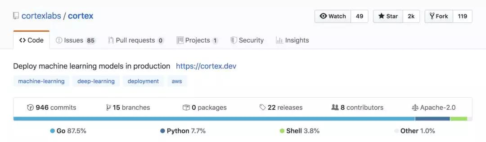
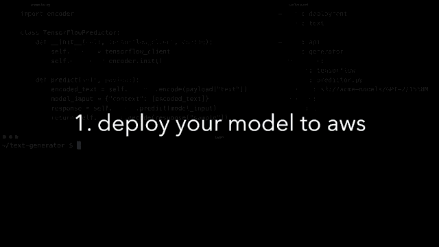

## 为何我们用 Go 而非 Python 编写机器学习基础设施平台？  

> 原创  
> Caleb Kaiser  
> 发布: AI前线  
> 发布日期: 2020-01-15  

作者 | Caleb Kaiser  译者 | 刘志勇  **AI 前线导读：** Go 又称 Golang，是 Google 开发的一种静态强类型、编译型、并发型且具有垃圾回收功能的编程语言。Go 语言于 2009 年 11 月正式宣布推出并开放源代码，开始在 Linux 及 Mac OS X 平台上进行了实现，后追加 Windows 系统下的实现。大部分用过 Go 语言的人都认可其是一种非常不错的生产力工具，有人总结其优点如下：部署简单、并发性好、语言设计良好、执行性能好。Cortex Labs 介绍了团队为何用 Go 而非 Python 编写机器学习基础设施。

**更多优质内容请关注微信公众号“AI 前线”（ID：ai-front）**

Python 是机器学习项目中最流行的语言，就这点而言，应该不会有人提出异议。尽管 R、C++ 和 Julia 之类的语言都有自己的拥趸和用例，但 Python 仍然是 最受欢迎的 编程语言，在每个主流的机器学习框架中都能见到它的身影。

最近，我们构建了一个将机器学习模型部署为 API 的开源平台—— Cortex，我们考虑了很久应该如何选择编程语言。最终的结果是代码库中有 87.5% 用的是 Go。经过一番比较，我们认为：Python 适用于机器学习，而 Go 适用于基础设施。

Python 所擅长的机器学习算法只是生产机器学习系统的组成部分之一。要实际大规模运行生产机器学习 API，你需要能够实现如下功能的基础设施：

* 可自动伸缩，以便在发生流量波动时不会中断 API。
* API 管理，用于处理同时部署的 API。

* 滚动更新，以便在为用户提供服务的同时更新模型。

Cortex 的构建旨在自动化实现所有这些基础设施的功能，以及其他关注点，如日志记录、成本优化等。Go 是满足这些因素的理想选择，原因如下：

**1\. 并发性对机器学习基础设施至关重要**

用户可以将许多不同的模型部署为不同的 API，所有这些 API 都在同一个 Cortex 集群中进行管理。为了让 Cortex Operator 管理这些不同的部署，它需要处理几个不同的 API。例举几个例子：

* Kubernetes API，Cortex 调用该 API 在集群上部署模型。
* 各种 AWS API：EC2 Auto Scaling、S3、CloudWatch 等，Cortex 调用这些 API 来管理 AWS 上的部署。

用户并不直接与这些 API 中的任何一个进行交互。相反，Cortex 是通过编程方式调用这些 API 来进行配置集群、驱动部署和监控 API 的。

要使所有这些重叠的 API 调用具有可执行性、可靠性是一个挑战。最有效的处理方式，是对它们进行并发处理，但同时也引入了复杂性，因为现在我们必须考虑竞争条件之类的问题。

对于这一问题，Go 有一个优雅的、开箱即用的解决方案： **Goroutines** 。

另外，Goroutines 也是 Go 并发执行的普通函数。我们可以写一整篇文章来深入探讨 Goroutines 是如何工作的，但从高层次来讲，Goroutines 是由 Go 运行时自动管理的轻量级线程。许多 Goroutines 可以放在单个 OS 线程上，如果 Goroutines 阻塞了一个 OS 线程，Go 运行时会自动将其余的 Goroutines 转移到新的 OS 线程上。

Goroutines 还提供了称为“通道”的特性，允许 Goroutines 在它们之间传递消息，还允许我们调度请求并防止出现竞争条件。

如果要在 Python 中实现所有这些功能，可以用 asyncio 之类的最新工具来实现，但 Go 在设计时就考虑到了这个用例，这点让我们的工作变得更轻松。

**2\. 用 Go 来构建跨平台的 CLI 更容易**

Cortex CLI 是一个跨平台的工具，允许用户直接从命令行部署模型和管理 API。下面动图显示了 CLI 的实际运行情况：

最初，我们用 Python 编写 CLI，但事实证明，试图跨平台进行分发实在是太困难了。因为 Go 可以编译成单一的二进制文件，不需要依赖管理，这就为我们提供了一个简单的解决方案，可以做到跨平台进行分发 CLI，而不需要做太多额外的工程计划。

与解释性编程语言相比，编译后的 Go 二进制代码的性能优势也非常显著。根据计算机基准测试的结果来看，Go 要 比 Python 快得多。

许多其他基础设施 CLI 工具都是用 Go 编写的，这可能并非偶然，这就引出了我们的下一个问题。

**3\. Go 语言的生态系统有利于推动基础设施项目**

开源的好处之一，就是你可以从你欣赏的项目中学习。例如，Cortex 存在于 Kubernetes（它本身就是用 Go 编写的）生态系统中。很幸运的是，在我们这个生态系统中，有许多伟大的开源项目可供学习，包括：

* kubectl：Kubernetes 的 CLI。
* minikube：本地运行 Kubernetes 的工具。

* helm：Kubernetes 的包管理器。

* kops 管理生产 Kubernetes 的工具。

* eksctl：Amazon EKS 的官方 CLI。

以上这些都是用 Go 编写的，而且不仅仅是 Kubernetes 的项目。无论你查看的是 CockroachDB，还是 Hashicorp 的基础设施项目，包括 Vault、Nomad、Terraform、Consul 和 Packer，它们都是用 Go 编写的。

Go 在基础设施领域的流行还有另一个影响，那就是大多数对基础设施感兴趣的工程师都熟悉 Go 语言，这使得 Go 更容易吸引工程师。事实上，Cortex Labs 最优秀的工程师之一，正是通过寻找 Go 开发岗位时遇到了我们，对此我们感到非常幸运。

**4\. 用 Go 进行工作是一种乐趣**

关于为什么我们最终用 Go 构建 Cortex，我要说的最后一点就是，Go 确实非常不错。

相对于 Python，Go 入门有点痛苦。然而，Go 的高冷性质使它成为大型项目的乐趣所在。我们仍然对软件进行严格的测试，但静态输入和编译，这两件事会让初学者有点不舒服，但这就像是我们的防护栏，帮助我们来编写（相对）没有 bug 的代码。

也许你会认为，可能还有其他语言可以提供某种优势，但总的来说，Go 最能满足我们的技术和审美需求。

结束语

我们仍然喜欢 Python，它在 Cortex 中也占有一席之地，尤其是在推理处理方面。

Cortex 为 TensorFlow、PyTorch、scikit-learn 和其他 Python 模型提供服务，这意味着与模型的接口以及推理前后处理都是用 Python 来完成的。然而，即使是 Python 代码也被打包到 Docker 容器中，这些容器也是由用 Go 语言编写的代码进行编排的。

如果你想成为一名机器学习工程师，那么就必须或多或少了解 Python，这是没有商量余地的。但是，如果你对机器学习基础设施感兴趣的话，那么，你就应该认真考虑使用 Go。

**作者简介：**

Caleb Kaiser，Cortex Labs 创始团队成员。曾在 Cadillac、AngelList 供职。

原文链接：

https://towardsdatascience.com/why-were-writing-machine-learning-infrastructure-in-go-not-python-38d6a37e2d76

福利推荐

更多人工智能与机器学习相关实践请持续关注 QCon 北京 2020，来跟业界大牛关注人工智能领域中正在兴起的技术和关键进展，探讨应用于机器学习问题的工程挑战及解决方案。目前大会 8 折报名中，点击【阅读原文】或识别二维码了解更多。有任何问题欢迎联系票务小姐姐 Ring：17310043226（微信同号）

##### 今日荐文

点击下方图片即可阅读

[

AI 数据标注不是“脏活累活”

* * *

**** **你也「在看」吗？** ****👇
