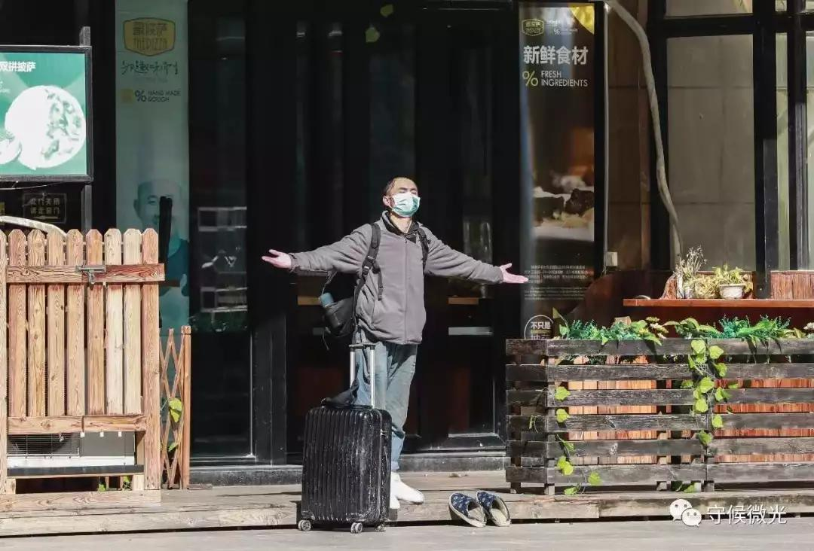
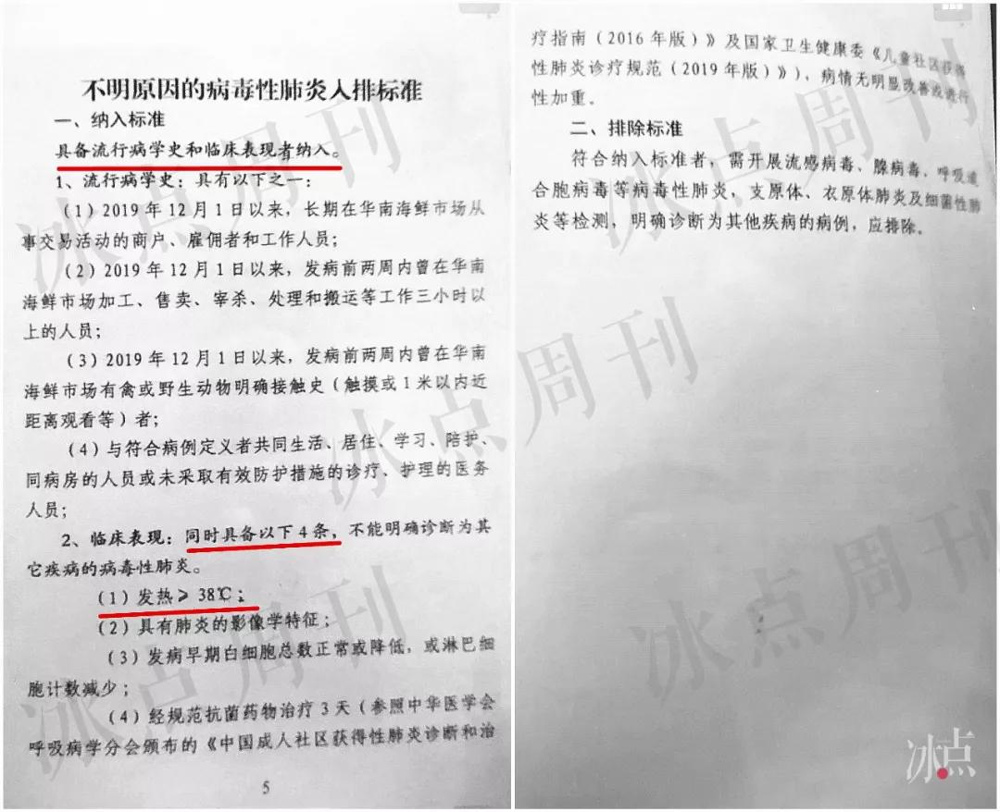
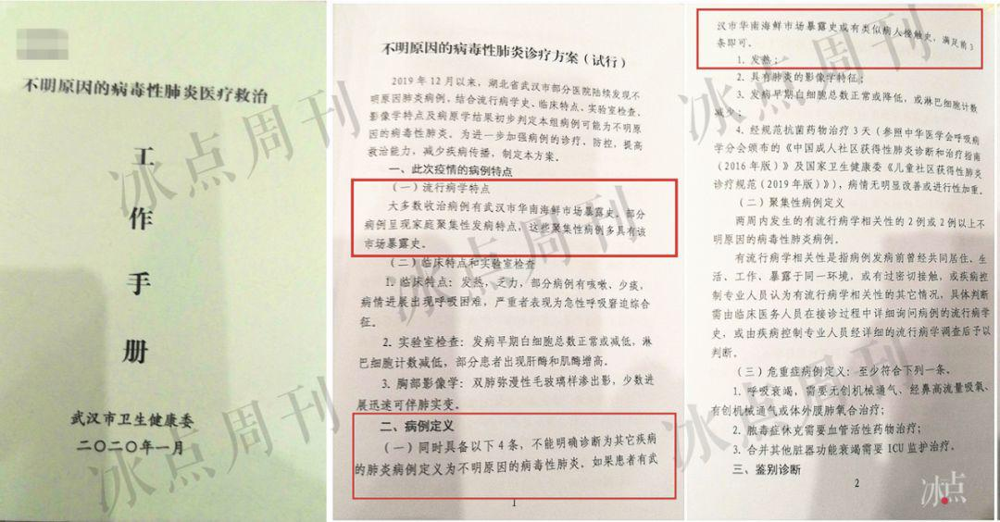
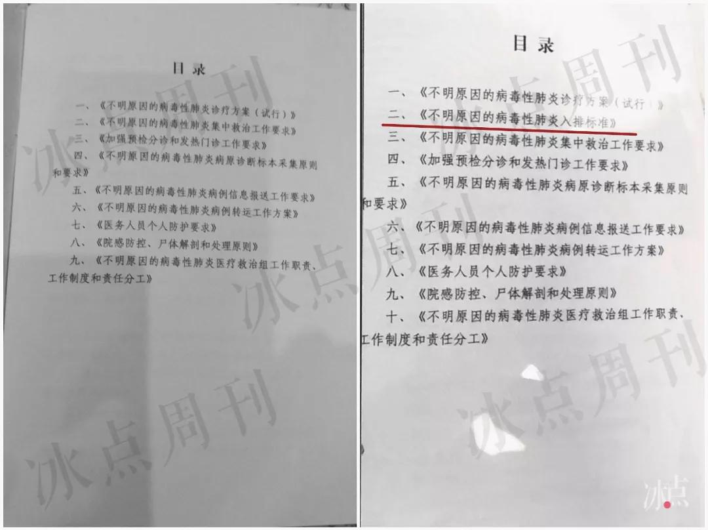
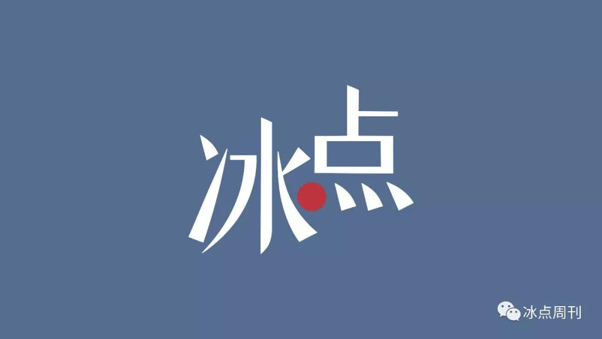

## 白皮手册与绿皮手册：新冠肺炎诊断标准之变  

> 原创  
> 杨海  
> 发布: 冰点周刊  
> 发布日期: 2020-02-20  

2月16日，湖北省武汉市，江汉区花楼街，雪后初晴，一名行人张开双臂享受阳光。中青报·中青网见习记者 鲁冲/摄

**作者  杨海**

**编辑 张国**

2019年最后一天，几位医疗专家受国家卫生健康委员会的派遣去了武汉。他们几乎都经历过2003年的非典型肺炎疫情，其中不少人都在那场大事件里令人印象深刻。

一种新的传染病在等着他们。当天午后，武汉市卫健委发布了关于新冠肺炎疫情的第一份通报：当地发现了27例病毒性肺炎患者，与华南海鲜市场有关联。

这种传染病最初被称为“不明原因的病毒性肺炎”，直到1月8日，病原被认定为新型冠状病毒。人们对它的认识从完全无知开始，有一个逐渐深入的过程。

1月16日，国家卫健委发布了第一版“国家级”诊疗方案，制定了确诊标准。在此之前，武汉作为疫源区，按照前期摸索出的标准来排查和治疗。

**绿皮手册与白皮手册**

武汉市一家三甲医院的急诊科主任刘越（应受访人要求化名）告诉记者，元旦假期后，医院开了一次会，参会的是科室主任。院领导向他们口头传达了一个“不明原因病毒性肺炎”的“上报标准”。

他清楚地记得，院领导拿的是一份“白色封皮的手册”。

刘越的同事、该院重症医学科主任井坤（化名）也表示，自己在同一场合听到了“上报标准”。

另一家三甲医院急诊科主任李夏（化名）也向记者证实，1月3日，所在医院召开了类似的会议。

“院领导要求这个上报标准只能通过面授、电话，或者微信语音传达。”李夏说。

这几位医生所说的“上报标准”，指的是武汉市卫健委的《不明原因的病毒性肺炎入排标准》。病例达不到这个《入排标准》，就不必上报。

一位知情人士向记者提供了这份《入排标准》。其中规定，患者“具备流行病学史和临床表现者”才能够纳入。

其中，“流行病学史”包括4条，患者符合其中一条即可：

1.2019年12月1日以来，长期在华南海鲜市场从事交易活动的商户、雇佣者和工作人员。

2.2019年12月1日以来，发病前两周内曾在华南海鲜市场加工、售卖、宰杀、处理和搬运等工作三个小时以上的人员。

3.2019年12月1日以来，发病前两周内曾在华南海鲜市场有禽或野生动物明确接触史（触摸或1米以内近距离观看等）者。

4.与符合病例定义者共同生活、居住、学习、陪护、同病房的人员或未采取有效防护措施的诊疗、护理的医务人员。

至于 “临床表现”，也分4条：

1.发热≥38℃。

2.具有肺炎的影像学特征。

3.发病早期白细胞总数计数正常或降低，或淋巴细胞计数减少。

4.经规范抗菌药物治疗3天，病情无明显改善或进行性加重。

按照《入排标准》，不能明确诊断为其他疾病的病毒性肺炎患者，需要 **同时满足4条“临床表现”，再满足“流行病学史”4条之一** ，才会被纳入。被纳入之后，患者需要做流感病毒、腺病毒等其他病毒性肺炎，支原体、衣原体肺炎，以及细菌性肺炎等的检测，“明确诊断为其他疾病的病例”，再排除。

不明原因肺炎入排标准。制图/李强

1月3日，武汉市卫健委的第二份疫情通报介绍，“疫情发生后，国家和省卫生健康委高度重视，派出工作组和专家组赴武汉市，指导当地开展疫情应对和处置工作”。

但是，中国青年报·中国青年网记者采访的国家卫健委专家组成员表示， **他们并未制定这样的《入排标准》** 。

“我从来没参与过《入排标准》的制定，国家卫健委一开始也不知道这个标准的存在。”国家卫健委第一批专家组一位成员对记者说：“这个标准是武汉后来加进去的。”

这位专家说，他后来才见到了那本白色封皮的手册，《入排标准》是其中一部分。

第二批专家组一位成员向记者提供了一份绿色封皮的《不明原因的病毒性肺炎医疗救治工作手册》，印有“武汉市卫生健康委”字样。手册内容包含《不明原因的病毒性肺炎诊疗方案（试行）》《不明原因的病毒性肺炎集中救治工作要求》，以及涉及病原诊断标本采集、病例转运、尸体解剖等工作的9份文件。

这位专家组成员说，不同颜色封皮的两份手册，在认定标准上是有差别的。

前述第一批专家组成员告诉记者，绿皮手册里《不明原因的病毒性肺炎诊疗方案（试行）》，由他们与湖北当地专家组共同制定，“日期大概在1月3日前后”。

按照绿皮手册里的诊疗方案，“病例定义”一项解释了哪些患者可以被确定为“不明原因的病毒性肺炎病例”。

“定义”一共有4条标准，分别为：发热；具有肺炎的影像学特征；发病早期白细胞总数正常或降低，或淋巴细胞计数减少；经规范抗菌治疗3天，病情无明显改善或进行性加重。

如果肺炎患者同时具备上述4条标准，且不能明确诊断为其他疾病，则可以被定义为“不明原因的病毒性肺炎（病例）”。

绿皮手册的标准中也提到“有武汉市华南市场暴露史或有类似病人接触史”，但 **并没有把这条标准作为必要条件** ，而是作为浮动条件——若病例符合该条标准，则只需满足前述4条标准里的前3条，即可定义为“不明原因的病毒性肺炎”病例。

绿皮手册的《不明原因的病毒性肺炎诊疗方案（试行）》。制图/李强武汉医生刘越、井坤、李夏都向记者表示，从未见过绿皮手册。他们都认为， **白皮手册的《入排标准》过于“苛刻”** ，不利于早发现、早确诊。

记者注意到，白皮手册与绿皮手册目录唯一的区别，是多了这份《入排标准》。就手册版本问题，记者询问了武汉市卫健委，未获答复。

左图：绿皮手册的目录
右图：白皮手册的目录 制图/李强

**“按照这样的标准，我们一个都报不上去”**

1月3日的医院会议结束后，井坤的重症医学科马上开辟出10多张隔离病床，用来收治不明原因的肺炎患者。据他回忆，从第一位患者入住开始，不到3天时间就已经满床。井坤所在医院制定了一份《不明原因肺炎疑似病例院内报告及诊治流程》，在院内报告环节，没有把华南海鲜市场接触史作为必要条件。“他们的临床表现太独特了，毫无疑问就是这个病。”井坤态度坚定，他没有参照《入排标准》，而是自作主张把这十几例全部上报给了医务处和院感办。但是，这十几名病人没有一个被定义为“不明原因的病毒性肺炎病例”——没有一个完全符合《入排标准》。

“很多患者没有华南海鲜市场接触史，也有发烧不到38℃的，有没有经过规范抗菌治疗的。”井坤说。

他科室的医生休息室的墙上挂着一块屏幕，上面是这十几位病人的监控视频。

通常情况下，医生都会用编号区别他们，因为他们太像了：大部分人都处在昏迷中，脖子上插着气管，有的人甚至上了ECMO（人工膜肺），躺在床上一动不动。

他们的相似点还体现在肺部CT影像里，“白的，全是白的”。

“就是这样的病人，也不符合那个《入排标准》。”井坤提高了音量，随后沉默了几秒。

武汉的很多医院执行了标准——据报道，华南海鲜市场附近的优抚医院，1月上旬发现医护人员和住院患者感染，但因为患者没有华南海鲜市场接触史，不符合诊断标准，没有上报。

井坤所在科室收治的病毒性肺炎患者，大部分都是从外院转来，还有些人发病后“已经在外面游荡了一个多星期”。

他无视“标准”上报病例的事情很快有了回响，是来自一位院领导的“严厉批评”，“嫌我们报太多”。

后来，医院有资格做核酸检测后，他收治的这些病人，超过60%的检测结果都是阳性——确诊新冠肺炎。他告诉记者，剩下的阴性患者，有不少已经接近痊愈，同时还要考虑核酸检测出现假阴性因素——中国医学科学院院长王辰也曾指出，核酸检测试剂质量不稳定，造成很多假阴性。

“ **按照这样的标准，我们一个都报不上去。** ”井坤说。

同样感到疑惑的还有李夏——所在医院的两个院区在1月1日开辟了发热门诊。后来的统计数据显示，1月4日成为患者数量上的一个拐点。那天的发热病人多了起来，有102名，“是平时的好几倍”。

“我们发热门诊太小，已经挤满了，只能把发热病人往急诊引流。”李夏说。

到1月15日，一天就有261个发热病人涌进了医院的急诊。这些多到“没地方坐”的发热病人，很难被报送至武汉的疾控部门。

“严格得不得了，根本没有一个符合（《入排标准》）的。”李夏告诉记者。这位医生也曾就《入排标准》向医院领导提出过疑问，尤其是“为什么又要求患者必须有华南海鲜市场接触史”，但没有得到回应。

“我们所有的准备都不足。”李夏感叹，“传染病病房要三区两通道，病房间还要相隔一定距离，我们都做不到。”

据武汉市卫健委通报，1月11日至1月15日之间，连续无新增病例。

2月18日，武汉市百步亭社区街头。一排灯笼前的横幅上写着“不服从小区封闭管理的要严肃依法处理”。中青报·中青网记者 赵迪/摄

中国疾控中心2月份完成的《新型冠状病毒肺炎流行病学特征分析》，回溯了截至2月11日中国内地报告的所有病例。以发病日统计，2019年12月31日前就有104人感染，15人死亡。

在不同时间，武汉不同医院的医生都发现，发热患者突然多了起来。武汉市第五医院的吕小红对记者说，她曾建议所在医院开设发热门诊，1月6日起，医院接到了很多疑似病例。

当地著名的武汉协和医院，不得不把感染科的整个一层楼，改造成呼吸道传染病隔离病区。

1月23日，武汉确定了第一批新冠肺炎定点医院。在此之前，众多无法被定义为“不明原因的病毒性肺炎”或“新型冠状病毒性肺炎”的患者，各自前往医院就医，没有得到恰当的隔离。

国家卫健委第二批专家组成员、北京大学第一医院呼吸内科主任王广发1月8日到了武汉，他随后得知，当地一家医院2019年12月肺炎的发生率较往年同期增加了17%。他在武汉工作期间感染了新冠病毒。

刘越管理的急诊科病房被征用为肺炎病人隔离病房前，他们没收到任何风险预警，“那时我们就戴普通的外科口罩，做常规的呼吸道防护”。

“当时知道有肺炎这个事，但是没听说我们医院有（病人），官方公布的数据又一直没有增长，也（说）没有明显人传人，就没当回事。”刘越告诉记者。“我们急诊科尚且这样，其他与传染病离得较远的科室就更大意了。”

1月20日，钟南山率领的国家卫健委高级别专家组在考察武汉后首次开记者会证实，武汉出现了人传人和医务人员感染情况。其中一位神经外科患者感染了14位医务人员。

在此次疫情中，刘越也是被感染的医生之一。他回忆自己唯一暴露的可能，是1月6日他们病房住进一名肺炎病人，他在那时没有得到任何有关危险的提示。后来，他负责的16张病床，有一次被4个家庭占据，那时他才清楚地意识到“这个病，人传人”。

武汉市卫健委在1月11日的通报里提到，“切实做到早发现、早诊断、早隔离、早治疗，集中专家和资源全力救治。”

与国家卫健委反复提及的早发现、早报告、早隔离、早治疗“四早”原则略有不同，在这里，“早诊断”代替了“早报告”。

**国家标准随着疫情进展几次更新**

与2003年SARS疫情不同，这一次，中国快速分离出病毒毒株，完成了基因测序，并向世界卫生组织分享了病毒序列，供全球共同研究应对之用。此举受到了世界卫生组织的赞赏。1月8日，病原初步被认定为新型冠状病毒。

同一天，第二批专家组到达武汉，承担的一项工作就是对《不明原因的病毒性肺炎诊疗方案（试行）》进行修订。两天后，中国疾控中心研制出诊断试剂盒，新冠肺炎病毒可以通过试剂盒和RT-PCR技术检测。

“我见到的是个绿皮手册，那时出了核酸检测，所以我们就加了一项‘确诊病例’标准，其他部分没有变化。”专家组一位成员告诉记者。

据这位专家说，很多天后，一位武汉医生给他打过电话，承认自己当时没对专家组说实话，明明感染了病毒，也没有承认。

前述三名武汉医生向记者说，当时确实增加了“确诊病例”标准，只不过是在白皮手册基础上增加的，而不是绿皮手册。

记者在《不明原因的病毒性肺炎诊疗方案（试行）》“此次疫情的病例特点”一项中发现以下表述：“大多数收治病例有武汉市华南海鲜市场暴露史，部分病例呈现家庭聚集性发病特点，这些聚集性病例多具有该市场暴露史。”

“我们当时知道已有的病例里，有小范围聚集性发病，但是这些人都与华南海鲜市场有关联。”前述专家组成员说，专家组得出“有限人传人”的论断，是缘于他们在武汉得知的信息。

1月16日，国家卫健委发布第一版《新型冠状病毒感染的肺炎诊疗方案（试行）》。至此，武汉市的试行方案停止执行。

这一天，在武汉市卫健委的通报里，多日“无新增病例”后，新增了4例。

国家卫健委第一版方案里，对“观察病例”（后改为“疑似病例”）的定义，“流行病学史”一项都是与“武汉”关联，而不是华南海鲜市场。“临床表现”规定了“发热”，但没有具体体温标准。

此后，国家标准随着疫情进展，几次做过修改。武汉大学中南医院医学影像科副主任张笑春曾提出，核酸检测不排除假阴性，建议将CT影像作为诊断方法。后来的标准采纳了此类意见。

2月12日起，湖北地区的标准进一步放宽，首次将“临床诊断病例”纳入确诊病例，一天新增了14840例，临床诊断病例就有13332例。国家卫健委副主任曾益新说，增加临床诊断病例，目的是便于患者早诊早治早隔离，接受规范化治疗，提高救治成功率。他表示，“因为设立这个项目，病例数确实有提高，这真实反映了武汉的情况”。

2月19日，国家卫健委发布了第六版诊疗方案。在最新版本里，取消了湖北省和湖北省以外其他省份的区别，统一分为“疑似病例”和“确诊病例”两类。

根据国家卫健委2月20日上午的通报，2月19日全天，武汉新增确诊病例615例，湖北另有4市新增13例，但由于10个市州对确诊病例中的原“临床诊断病例”进行核酸检测，将核酸检测结果为阴性的病例从确诊病例中核减，共订正核减279例，因此湖北公布的新增确诊病例为349例。这是多日来，湖北单日新增病例 **首次回落到三位数——** 随着认识不断深入，国家标准不断改进，“ **应收尽收，应治尽治** ”的目标也日渐接近。（记者王嘉兴对本文有贡献）

**

**

（本文由中国青年报独立出品，首发在中国青年报客户端及头条号，加入树木计划。）

**中国青年报·中国青年网 出品**觉得好看请点这里 

