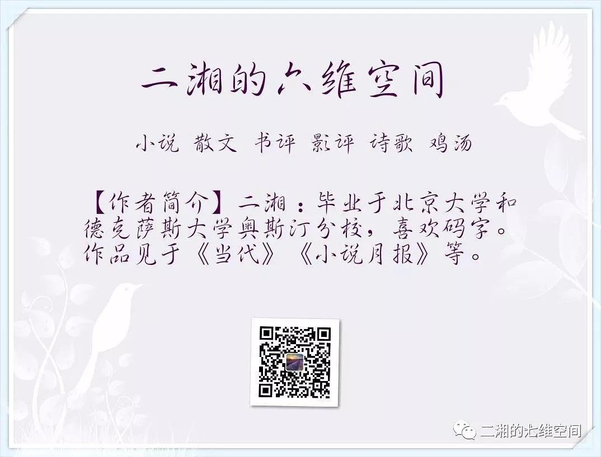

## 方方：不止你一个人痛苦和艰难，人活着有很多方式  

> 方方  
> 发布: 二湘的七维空间  
> 发布日期: 2020-02-18  

方方武汉日记正月二十四（2月17日）

_只有小说会告诉他，落后也没关系，很多的人跟你一样，不止是你一个人孤单或寂寞，不止你一个人痛苦和艰难，也不只是你一个人有焦虑和脆弱。_

人活着有很多方式

文／方方

依然天晴。如在往日，坐在外面晒太阳的人一定会很多。可惜现在，那种温馨晒太阳的画面完全见不到。可以理解，这是非常时期。人们站在窗口看看阳光，看看窗外的绿树，也不错。
最严管控命令已经下达：所有人都必须呆在家里。只有不得不出门工作或执行公务的人，才能外出。但他们手上必须持有通行证。听说，如果在街上没有通行证的人，会被抓起来，隔离十四天。不知道是不是真的。段子手说，武汉还算好，如在黄冈，隔离中还得做黄冈秘卷初二的数学题，且说一大半的人都做不出来。几天来，段子手都比较沉闷，这是今天一个比较好玩的。我特别希望段子手们活跃起来，以让封城二十多天武汉人在转发中忍不住笑出几声。
对我这样的人，不出门是很容易做到的事。狗也不用遛，由它自己在院子里自遛。好在它也老了，习惯在院子里打几个转就回洗衣房睡觉。我给它单独配了一个电暖器，它就更愿意趴在窝里不出来。今年我自己也有点鬼使神差。在元月中旬将过年时，突然心血来潮，把家里的暖气锅炉换了新的。安装时间是暖气公司放假前的最后一天。旧的锅炉尽管也能用，可我担心它已用过多年，不太保险。新锅炉的能量果然不同，它让我屋里的温度始终保持在22—25度之间。而且我也不用担心它是否会出现问题。前一阵气温上升，家里甚至到25度以上，让我感觉到了热。
在严禁外出令下，武汉各小区的买菜群迅速壮大，而电商也立即调整自己的销售模式。现在想想，如果没有电商，困守在家的日子还真不好过。光是一家人吃喝都成问题。现在，针对各小区的买菜群，电商亮相了。他们在销售中不断根据实际情况，灵活调整。各种“无接触配送”套餐，也纷纷出台，居民在买菜群申请登记，电商团购送货。买菜群的群主，也会随电商的调整，组织得更加合理。比起机关那些死板僵化地按文件走程序的弱智行为，民间的能人实在强大。这就是实事求是的做事方式，官方太应该学习和借鉴。说句大实话，如果不是各部门刻板僵化，层层拖延，个个误事，疫情都不至于发展到今天这步。我同学老耿知道我不愿加入各种群，便把群里有什么东西可卖直接转发给我。前天我要了一份仟吉面包套餐。一大堆，应该是三口之家的分量。对我来说，实在太多，至少要吃十天。
今天又特意去找医生朋友了解疫情情况。其实也就是我提问，他回答。归结起来，大概这样几点。
一、关于雷神医院王院长所说拐点已经到了这个话题。医生朋友说，王院长说的拐点不是这个概念。拐点是一个科学名词，通俗讲，就是发病人数到了最高点。从这个概念看，拐点没有到。也就是说，我们的发病人数，还在上升。但是医生朋友个人认为，二月底或三月初，真正的拐点应该会来到。我掐指一算，还得两周。
二、关于医护人员那么多人被感染，甚至还有几位殉职。现在他们的情况怎么样。医生朋友说，有三千多医护人员被感染。但绝大多数能痊愈，因这个疾病的病程较长，所以大多人还没出院。三千多人，这官方公布的数字。但我想，实际可能会更多一些吧。这些几乎都是早期未曾设防、以及医疗防护用品的极度缺乏时期的事。现在受感染的人已经很少很少了。
三、武汉在治疗病人过程中是否用了中药。医生朋友非常肯定地回答说，75%的病人都用了中药，有明显疗效。我问为什么另外25%不用呢？医生朋友说，有的人插管，用不成呀。插管者，显然是重症。这个比例很吓我。
四、那么重症病人占多少，治愈率如何呢？医生朋友说，以前武汉危重病人占38%，因为很多不重的病人住不进院，发展成重症。现在病床增加了很多，病人可以及时入院及时治疗，所以武汉的重症及危重症已降到18%。而且治愈率也比以前高了很多。我想，相对近六万人的确诊病人，这仍然是很大的一个数字。死亡率恐怕一时还真的降不下来。
网上有人说，你成天就会记录这些琐细，为什么不记录解放军进城，不记录全国人民的关心和支持，不记录火神山雷神山的伟大成就，不记录英勇无畏前来援助的人们等等。其实，这话要我怎么说呢？说记录也是各有分工，他们听不听？吃菜也分大菜和小菜，不是吗？全国那么多官方媒体，那么多网络自媒体，他们每天都在记录人们要求的这些。宏观视角、疫情走向，英雄气概、青春热血等等，这样的文章业已多如牛毛。
而我是一个个体写作者，我只有小的视角。我能关注到能体会到的，只有身边一些碎事，以及一个个具体的人。所以，我只能作一点琐事记录，写一点即时感想，为自己留下一份存活过程的纪念。
还有，我的主业是写小说。以前谈小说感想时，我说，小说经常是与落伍者、孤独者、寂寞者相濡以沫的。与之携手共行，甚至俯身助人。小说更宽阔地表达着一种人情和关怀。有时候会像老母鸡一样，护着那些被历史遗弃的人事，被前进的社会冷落的生命。陪伴他们，温暖他们，鼓舞他们。更或许，小说自己会呈现与他们同命相怜的气息，也需要他们的陪伴、温暖与鼓舞。这世上的强人或是胜者，经常是不介意文学的，他们更多的时候拿文学当点缀、当花环，但弱者们，却经常拿小说当了自己生命中的一盏灯，水中的一根救命稻草，垂死时的救命恩人。因为在那个时候，只有小说会告诉他，落后也没关系，很多的人跟你一样，不止是你一个人孤单或寂寞，不止你一个人痛苦和艰难，也不只是你一个人有焦虑和脆弱。人活着有很多方式。成功固然好，不成功也不是坏事。
看看，我这个写小说的人，在我自己每日记录琐碎时，仍然会沿着自己的写作走向，去观察去思考去体会去落笔，这难道还是个错误？
昨天的微信又遭删除。无奈之中，还是无奈：封城记录何处发，烟波江上使人愁。

_ _ _方方武汉日记由方方授权“二湘的七维空间”微信独家首发，因发现个别公号利用方方武汉日记接受打赏，方方自2月14日起授权此公号发表时标注原创。_ _公号转载请联系后台。_

_以防失联，关注“二湘的六维空间”，回复9，12,  15，16, 17，18，19，20，21，22，23，24收看方方其它日记。_

【作者简介】方方：原名汪芳，祖籍江西彭泽，生于江苏南京，现居武汉，中国当代女作家，代表作《万箭穿心》《风景》，最新长篇《是无等等》，个人微信公号“方方记录”。

[方方：今夜我不关心脑残，我只关心你](http://mp.weixin.qq.com/s?__biz=MzI4OTA0MjgyNA==&mid=2457192098&idx=1&sn=52baeb7fa5c1d904a84f374e8a6edbfc&chksm=fbb45e45ccc3d7535363cfdc066fad9ae15c87b6ec91aff63b93f39af038e7994e8c052a74e7&scene=21#wechat_redirect)[《夏至的梅里雪山》第五章（完）星际之爱](http://mp.weixin.qq.com/s?__biz=MzI1MzMyNzcxNg==&mid=2247485771&idx=1&sn=bf184ecce5054e5400685265dd9a0ce2&chksm=e9d76940dea0e0566a1bbca01a734bd82811fae927cad05676ea30eaa7c84ebc64dea15c7f28&scene=21#wechat_redirect)[暗涌下的命运、爱和情欲](http://mp.weixin.qq.com/s?__biz=MzI1MzMyNzcxNg==&mid=2247485557&idx=1&sn=2e6efe0a8841f2ba6d3aaf9c2bba4e00&chksm=e9d7687edea0e1687a7e0526f0a2c4e367c4363edd3a8e170fe3dab391619699962d0d4fe1e7&scene=21#wechat_redirect)

方方武汉日记：[十五 ](http://mp.weixin.qq.com/s?__biz=MzI4OTA0MjgyNA==&mid=2457192042&idx=1&sn=7f2ea259bb0c662962d4bc5547b73cd4&chksm=fbb45e8dccc3d79bbeab0d8e07e78f20a83d3b1d33bc57b0f29fa5906ad03b7372ba7720c2a6&scene=21#wechat_redirect) [十六](http://mp.weixin.qq.com/s?__biz=MzI4OTA0MjgyNA==&mid=2457192048&idx=1&sn=586951f07dd4f2814430394fd694fe70&chksm=fbb45e97ccc3d781bca9430e3eda26d6608730b5e0752e7d9bfc3a18a48c83e557281fbd68fb&scene=21#wechat_redirect)  [十七 ](http://mp.weixin.qq.com/s?__biz=MzI4OTA0MjgyNA==&mid=2457192055&idx=1&sn=f8bb28271b5091933d39806cecdeba31&chksm=fbb45e90ccc3d786cd643d36d6eda641525230f63ef56a7141ad58dd0f4633f29dc75c455605&scene=21#wechat_redirect) [十八](http://mp.weixin.qq.com/s?__biz=MzI4OTA0MjgyNA==&mid=2457192063&idx=1&sn=57579acb8eadffa9bfdf586e5295008f&chksm=fbb45e98ccc3d78e1b510dc5d922976ce2524ff6c94724daeee57ff1e17c048209096e272582&scene=21#wechat_redirect)  [二十](http://mp.weixin.qq.com/s?__biz=MzI4OTA0MjgyNA==&mid=2457192086&idx=1&sn=b44e875f13ac62b57535955372ae9132&chksm=fbb45e71ccc3d767ac26ea6d2b9bc774802eea6db62ce98d1c9b0b4f32554d21e8f9d3ee996c&scene=21#wechat_redirect)   [二十一](http://mp.weixin.qq.com/s?__biz=MzI4OTA0MjgyNA==&mid=2457192093&idx=1&sn=474f859ec2fed4e101397fef62025d35&chksm=fbb45e7accc3d76c83cd10e01f6d34d908d52cab0fe4903411df5da94e06c028b4ecf2efec0e&scene=21#wechat_redirect)    [二十二](http://mp.weixin.qq.com/s?__biz=MzI4OTA0MjgyNA==&mid=2457192098&idx=1&sn=52baeb7fa5c1d904a84f374e8a6edbfc&chksm=fbb45e45ccc3d7535363cfdc066fad9ae15c87b6ec91aff63b93f39af038e7994e8c052a74e7&scene=21#wechat_redirect) [ 二十三](http://mp.weixin.qq.com/s?__biz=MzI4OTA0MjgyNA==&mid=2457192103&idx=1&sn=c9490fe90e880f9c3f7e3f5831ec1d21&chksm=fbb45e40ccc3d756fde70352050d2df6fc40e9b233f29f9130e31274bc2be40306f972d58535&scene=21#wechat_redirect)

《夏至的梅里雪山》：[第1章](http://mp.weixin.qq.com/s?__biz=MzI1MzMyNzcxNg==&mid=2247485751&idx=1&sn=a8dcf19ccfa4951ba7f2b76132ce6d3e&chksm=e9d7693cdea0e02a9a421077feed1c7fb4bc90d7f01b3a07c7ca57ff5e1350eafe0df11bec67&scene=21#wechat_redirect)  [第2章](http://mp.weixin.qq.com/s?__biz=MzI1MzMyNzcxNg==&mid=2247485756&idx=1&sn=45defa28f99bc11ca12b0ee1ab819b24&chksm=e9d76937dea0e021d677fb1e37c5ae9d22e03e58ab1601e807fdb43509dd40f7f5444401e992&scene=21#wechat_redirect)  [第3章](http://mp.weixin.qq.com/s?__biz=MzI1MzMyNzcxNg==&mid=2247485761&idx=1&sn=2c9ce1cf8ad36848d7a95f07d81dd604&chksm=e9d7694adea0e05c3dc07be6b54baeeaa7fe5de468639665be95984ecadafcb05d3bc1e9762c&scene=21#wechat_redirect)  [第4章](http://mp.weixin.qq.com/s?__biz=MzI1MzMyNzcxNg==&mid=2247485766&idx=1&sn=1dc8b2775e7f2e65739f02f7bdc6ecd0&chksm=e9d7694ddea0e05bab1fb8d9b6226c059c8a1e0d0f5e85f43d36a9511e1fdf1d2832d2e5af57&scene=21#wechat_redirect)  [第5章](http://mp.weixin.qq.com/s?__biz=MzI1MzMyNzcxNg==&mid=2247485771&idx=1&sn=bf184ecce5054e5400685265dd9a0ce2&chksm=e9d76940dea0e0566a1bbca01a734bd82811fae927cad05676ea30eaa7c84ebc64dea15c7f28&scene=21#wechat_redirect)

二湘：[分裂的朋友圈 ](http://mp.weixin.qq.com/s?__biz=MzI1MzMyNzcxNg==&mid=2247485737&idx=1&sn=03eac7e505f6b5c087a134548baac06e&chksm=e9d76922dea0e0344d8fdc3224dd9b274043b107860763415c03ca676f325a3a5e25a0e8ba8d&scene=21#wechat_redirect)   [遗忘武汉](http://mp.weixin.qq.com/s?__biz=MzI1MzMyNzcxNg==&mid=2247485655&idx=1&sn=2b70786656055342ec8b18e23ae6556c&chksm=e9d768dcdea0e1ca5a046e05813b112abfdde811ac0365bbe3647ad8a47a8f4d9d74f59a3851&scene=21#wechat_redirect)   [《1917》](http://mp.weixin.qq.com/s?__biz=MzI1MzMyNzcxNg==&mid=2247485742&idx=1&sn=5490333159a0ccfe167686db07f51613&chksm=e9d76925dea0e0333cdd0b054360532e7d5ab50989990cda25a870c63b5ab044e8354d3d1c84&scene=21#wechat_redirect)  [《暗涌》](http://mp.weixin.qq.com/s?__biz=MzI1MzMyNzcxNg==&mid=2247485086&idx=1&sn=d2ef61ab2b001a507c2bb9c4c22471a6&chksm=e9d76695dea0ef83baf417bc4aab27ffdc1bccfca9f62ef8a42f5ec812f06ef82c72ed1392f4&scene=21#wechat_redirect)  [《狂流》](http://mp.weixin.qq.com/s?__biz=MzI1MzMyNzcxNg==&mid=2247484332&idx=1&sn=f15d500500d6a2e2319d2f299e3de715&chksm=e9d763a7dea0eab1a6a79ba7b19565e028f18b9988b30ed8c6a0a29daf5e514e511f1fcf3829&scene=21#wechat_redirect)

他山之玉：[刘瑜  ](http://mp.weixin.qq.com/s?__biz=MzI1MzMyNzcxNg==&mid=2247484613&idx=1&sn=86f0164931aebe10b8d4bcecead30485&chksm=e9d764cedea0edd83d7d3be15c2cf807b4d8532833c5b84cbe287952fd584a4ca79ef4ec61ed&scene=21#wechat_redirect) [冯唐](http://mp.weixin.qq.com/s?__biz=MzI1MzMyNzcxNg==&mid=2247484683&idx=1&sn=c2e6ee9784b2a58413504b62926a5f52&chksm=e9d76500dea0ec1601ed7f866bc6b9e8331b7dc58c1e61811af2d02073fa1a31cdfe255ab703&scene=21#wechat_redirect)   [宝树 ](http://mp.weixin.qq.com/s?__biz=MzI1MzMyNzcxNg==&mid=2247484705&idx=1&sn=0162ad2adce1f363d0a20cdb57eec5b4&chksm=e9d7652adea0ec3c7f436cdfdc84f386bdb2905df9300b07780ad81161589c10be2b52e8eb7f&scene=21#wechat_redirect) [北星 ](http://mp.weixin.qq.com/s?__biz=MzI1MzMyNzcxNg==&mid=2247484700&idx=1&sn=05c998180d7c23f8be456316fe904d03&chksm=e9d76517dea0ec01bbff61c2f6ff086a996a801ac5f3c53a89d104c2ed73bdcd39eda09b8448&scene=21#wechat_redirect)[陈揪帆 ](http://mp.weixin.qq.com/s?__biz=MzI1MzMyNzcxNg==&mid=2247484995&idx=1&sn=b627fc6c738d3e4939b592e216816fc2&chksm=e9d76648dea0ef5e2e4ea92aa0a78786e7da19ce0aeafd07070b1a0d52b053e4db45948885e3&scene=21#wechat_redirect)  [郝景芳](http://mp.weixin.qq.com/s?__biz=MzI1MzMyNzcxNg==&mid=2247485266&idx=1&sn=16e04fb04e1eaa004344b6df71c57511&chksm=e9d76759dea0ee4f94db1a53bb0dd71da228dc0a2a74fbc84ba9f1e02bf66a4d19d4bf9ddd13&scene=21#wechat_redirect)  [严锋](http://mp.weixin.qq.com/s?__biz=MzI1MzMyNzcxNg==&mid=2247485319&idx=1&sn=cc1abed5290fd592ce5f8aecc5c8061a&chksm=e9d7678cdea0ee9a15bf1eb2e59d93ec346d1478eaf943c4c339653206c8ca68b40ed75a03d3&scene=21#wechat_redirect)  [邓安庆  舒飞濂](http://mp.weixin.qq.com/s?__biz=MzI1MzMyNzcxNg==&mid=2247485664&idx=1&sn=fd272b2a68b691278c4739f5234b26ee&chksm=e9d768ebdea0e1fd11bd93711a73614b0a9f135cf5bd90d3c02db898d9da11137d68a25cc327&scene=21#wechat_redirect)

