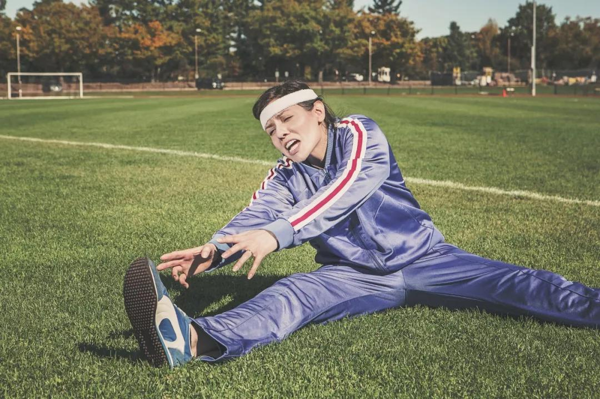

## 铺天盖地的炒作下，我依然觉得深度强化学习是浪费时间  

> 原创: JToy  
> 发布: AI前线  
> 发布日期: 2020-02-08  

作者 | Joseph Chin  译者 | 核子可乐  **AI 前线导读：** 深度强化学习（deep reinforcement learning，DRL）是深度学习与强化学习相结合的产物，它集成了深度学习在视觉等感知问题上强大的理解能力，以及强化学习的决策能力，实现了端到端学习。深度强化学习的出现使得强化学习技术真正走向实用，得以解决现实场景中的复杂问题。深度强化学习被认为是通往通用人工智能圣杯的必经之路。但是，事实如何呢？

**更多优质内容请关注微信公众号“AI 前线”（ID：ai-front）**

现在，我们刚进入 2020 年，我想看看 2019 年人工智能进展怎么样了。特别是深度强化学习（Deep Reinforcement Learning，Deep RL），已经被炒作是通往通用人工智能（Artificial General Intelligence，AGI）的下一个关键阶段，通用人工智能是一种计算机算法，可以像人类一样学习做任何事情。

几年来，研究人员一直在致力于深度强化学习的研究，取得了渐进性进展。围绕深度强化学习的想法和希望是，你可以轻松地训练智能体去做理论上的任何事情，比如开车、叠衣服、玩电子游戏、打扫房间、解魔方等等，而所有这些都不需要掌握学习过程。其中一些实验已经取得了一定的成功，你可以教会深度强化学习智能体玩一些电子游戏和棋类游戏，但是将深度强化学习的任何成果转移到现实世界的生产系统中，却无一例外都失败了。截止目前，2020 年 1 月，我仍然不知道有哪一个生产系统使用了深度强化学习。

深度强化学习系统有很多问题，在本文中，有关这些问题的细节我不打算赘述，因为有很多博文已经讨论了这些问题。

深度强化学习存在什么问题？

如果这些问题中，哪怕只得到了一点点改善或者解决，比如，找到更抽象的方法来表示神经网络内部的信息，我并不会为此感到震惊，但是，如果不能解决那些我认为是核心问题，也没有关系：手动奖励函数（工程）。在深度强化学习中，我想说的是，大部分时间都花在了设计你的奖励函数上，以便让你的智能体能够做你想做的事情。用更传统的机器学习术语来说，奖励函数就是一个目标函数，算法使用这个函数来判断它是否朝着正确的方向前进，获得的奖励越多，模型就越“好”。

例如，教会机械臂叠衣服，假设你有一堆裤子，你该如何写一个奖励函数来正确地叠衣服呢？当你向另一个人描述这一点听起来很容易，不过是“把这堆裤子叠整齐了”。但是，计算机根本就不理解这些规则是什么意思。对于每个实验，你必须用一种计算机能够自己衡量进展的方式来设计你的奖励函数，而不需要知道它实际在做什么。因此，你可能会从机械臂触摸裤子开始奖励，然后机械臂抓住裤子或者移动裤子就奖励更多的分数。实际的折叠动作这块，你该如何奖励呢？叠三折可以得到奖励吗？不起皱的话，奖励怎么算？你最终花了如此多的时间试图引导智能体遵循正确的路径，以至于它基本上已经变成了完全监督式学习的问题。

从理论上讲，你可以让一个人监视训练过程，然后他为系统采取的每个动作打分进行奖励，但这个并不具有规模性。这些深度强化学习系统需要在任何地方运行，从成千上万次到数百万次的迭代，尝试各种动作的变化，以找出实现目标的正确序列，而人类不可能监视计算机所采取的所有步骤。目前，有很多活跃的研究，试图通过模仿学习来实现这种规模化，但对我来说，这些做法只不过是在原本就已经支离破碎的东西上修修补补而已。

在试图训练机械臂叠裤子的过程中，你可能需要不断调整奖励函数，因为机械臂可能会不小心撕烂裤子、掉落部件、从里往外翻过来时折叠它们，或者以看起来没有任何意义的、奇怪的方式进行折叠。奖励工程变成了一个不断试错的实验过程，通过反复实验来确定什么是有效的操作。有无数的记录报告表明，深度强化学习模型经常会做出各种意想不到的动作。强化学习通常被与监督式和无监督式机器学习一起被归为第三类，但在我看来，它实际上就是监督式学习。

当前，深度强化学习的过程是：你开始训练这个模型，然后你看着模型失败，然后，你一遍又一遍地调整奖励函数，直到可能，只是可能，你得到了一个你想要的输出。这里面有哪个部分没有给它提供训练数据呢？你已经让整个过程变得复杂化了，将答案以非直接的方式提供给智能体，从而使所有的事情都变得更加困难了。如果计算机要从它们的环境中学习，它就必须在百分百无人监督的环境里进行。

为何深度强化学习有如此铺天盖地的炒作？

如果你从抽象层次来看待深度强化学习的话，它会被描述为是这样的一个智能体，能够随着时间的推移从它所在的环境中进行学习。这看起来似乎是完全正确的，而且也确实模仿了现实，所有的生物都是从出生开始就学习如何在它们所处的环境中生存和探索。我们之所以知道这一点，是因为我们已经进行了许多实验，经验表明，如果我们改变和限制新生生物所在的生存环境，它们就会学到不同的东西，并且，行为也会有所不同。

深度强化学习与传统的机器学习方法（如监督分类）有很大的不同，在传统的机器学习方法中，它是一个静态模型，可以用于获取原始数据、回答问题并构建用于生产环境的模型。传统的深度强化学习框架中存在问题的是信号源。这些人工智能体必须直接从环境中学习，而不是从我们提供给它们的某种手动奖励函数中学习。当 DeepMind 推出一个可以在几乎没有任何干预的情况下玩雅达利（Atari）电子游戏的深度强化学习智能体时，人们认为它可以扩展到其他领域的各种问题，甚至是潜在的通用人工智能。而我们所了解到的是，生物和人类所做的大多数事情，都不能建模成电子游戏，在游戏中，智能体会为了获得尽可能多的奖励而进行优化。不要被深度强化学习无需人工操作就能赢得游戏所唬住，奖励函数（工程）仍然会发生——40 年前，当时电子游戏制造商雇佣了整个团队来制作这些游戏。

许多人犯了错误，他们认为深度强化学习就是通往通用人工智能的下一步，甚至谷歌对此也表现出了极大的热情，并斥资 5 亿美元收购了 DeepMind，希望将人工智能提升到一个新的水平。社区似乎也将深度强化学习当成了圣杯，因为它是最接近于模仿我们自身现实的机器学习形式，尽管在现实中，它实际上还差得很远。我们最后得到的只是许多雕虫小技，小小的人工智能玩具可以玩各种电子游戏、棋类游戏，除此之外就别无它用了。

从更传统的机器学习方法转向深度学习的主要好处在于，它使人工繁重的工程不复存在。从理论上讲，你可以为模型提供大量数据，运行优化算法，它将无需你手动编写特征提取代码即可进行学习。因此，深度学习已经被应用到强化学习的一部分，主要是在智能体一端以像素的形式获得感知数据，但如果你仍然花费大部分时间花在手工设计系统，那么在我看来，它仍然没有起到应有的作用。我甚至没有深入讨论其他深度强化学习问题的细节，比如如果你需要稍微修改目标，就要做好重新训练整个系统的准备；或者环境中的细微变化通常会导致前功尽弃……而通用人工智能还在路上。

这就是为什么我们现在有顶尖的机器学习研究机构，DeepMind 和 OpenAI，仍然将大部分时间和资源花在深度强化学习上的原因。他们不断地用公关信息轰炸互联网，展示他们正在取得的巨大进步：深度强化学习可以下围棋、打星际争霸、Dota 2、解魔方等等。

我搞不懂他们为什么继续花这么多时间来构建深度强化学习系统，这些深度强化学习系统只不过是用明确定义的规则和积分系统击败游戏罢了。我想，现在每个人都已经明白，只要有足够的时间、金钱和算力来暴力完成每一个可能的动作，深度强化学习几乎可以打败任何游戏。我相信他们的策略很大一部分是公关文章抛出烟幕弹，展示最新的深度强化学习如何击败下一个最好的游戏，这样，他们就可以继续忽悠那些不太了解的人来投资，只要看看 Microsoft 给 OpenAI 的 10 亿美元，还有 Google 仍然继续为 DeepMind 烧钱。DeepMind 最近取得的成功之一（在被 Google 收购约 5 年后），是他们训练了一个深度强化学习的智能体来下围棋、国际象棋、日本将棋和雅达利游戏。是的，更多的电子游戏！我并不是想要打击他们，我真的很高兴他们始终没有放弃，一直努力解决通用人工智能的问题。

是时候让深度强化学习做点什么了

但问题在于，他们制造了许多错误的认知，最终在死胡同上浪费了大量的人力。首先，他们发布的所有公关文章如出一辙，如“我们的文本生成模型（GPT-2）太过危险而不能发布”之类，让公众认为我们离通用人工智能越来越近了，但实际上，业内每个人都知道，我们离通用人工智能还远着呢。其次，更重要的是，他们向人工智能研究人员发出了错误的信号，让他们将更多的时间花在深度强化学习上。许多研究人员和黑客都仰望这些公司，看到这些公关文章泛滥成灾，当他们本可以将精力集中在更大、更根本的问题上时，他们却花了无数的时间来解决同样的问题。如果人工智能和通用人工智能要向前发展，我认为，是时候停止玩电子游戏，集中精力解决更棘手的问题了。

幸运的是，DeepMind 和 OpenAI 确实在其他问题领域花费了时间，但正如我所言，深度强化学习仍然是他们的主要关注点。

目前的深度强化学习系统似乎非常适合那些已经接受过基本训练的系统。想一下迁移学习，在这种情况下，如果智能体对其所在的环境和自身有了基本的了解会怎么样。观察一个人类婴儿从出生开始，他首先要学会看形状和颜色，动动手指，触摸物体，控制他的身体，辨别声音，了解重力、物理现象、下坠、柔软、弹力，了解物体的渗透性等等。而所有这一切都在不同程度上发生在每一个活生生的人和生物身上。通常情况下，当人类婴儿掌握了大量的知识之后，就可以走路、抓住物体、上厕所、进行基本的交谈等等，然后就进行更正式的训练，例如把小孩送到学校，在那里他会经历更有组织的学习过程：家庭作业、评分和测验，以训练孩子从课程中学习到知识。

当前的深度强化学习系统似乎可以很好地用于这种正式的训练，在这种训练中，可以清楚地达到期望的目标，并且在智能体已经基本掌握它所在的环境后，大多数情况下能够自动进行评分。如果孩子不能背诵 ABC，就是不及格；如果他们能够背下整个字母表，就算及格。目前，深度强化学习是本末倒置的，我们试图从零开始训练计算机来完成复杂的任务，有时候可能会能完成，但这是因为这些模型是为特定的任务而不是泛化进行训练的，他们对自己的环境没有全面的了解，最终导致系统过于脆弱，无法很好地工作。只要奖励函数不是固定的，那么再多新的学习算法，如反向转播、DQN、PPO、DDPG、TRPO，都无法修复深度强化学习。

我相信，我们会不断改进，也许会从星际争霸中获得更多的分数，但如果没有基本的架构转变，允许智能体以无监督的方式从它所在的环境中学习，那么它就不会为通用人工智能的圣杯做出巨大的贡献。

我自己的设想是，学习生物的奖励功能实际上是保持稳态和最小化意外来驱动的。稳态是生物维持生存所需的稳定条件的过程。每个生物都必须生存下来，并保持其身体与外界环境分离。饥饿时，它就会进食；疲倦时，它就会睡眠；口渴时，它会喝水；被追捕时，它会逃避；天热时，它会避暑；如此等等。这些与生俱来的原始信号告诉生物在环境中探索时应该做什么，以及关注什么。如果做不到这些的话，就会导致无法维持稳态，最终导致夭折。

当生物在四处游荡时，它会建立一个模型，它自己的感知运动与环境交互，因为它要与外界互动。它的模型开始将所有的东西组合在一起：天黑的时候，天气应该是寒冷的；当打嗝的时候，应该能听到一个声音；当用手指抚触杯子时，应该能感觉到光滑的表面；当通过声带发出声音时，应该在耳朵里听到相应的声音；等等。如果发生任何意外情况，偏离了它的模型，那么模型就会重新调整它的预测，直到它得到所期望的结果，这可能会导致更多的变化。如果失败了，那么就会出现真正的意外，这些神经元就会被标记为“需要模型更新”，在这种情况下，重新学习和重新优化可能会实时发生，也可能在生物睡眠时发生。优化发生在智能体的内部环境模型和实际环境之间，并持续运行以最大程度减少意外。这些观点在神经科学和哲学中已经讨论了很长一段时间，像 Andy Clark 的关于 预测处理 的观点、Karl Friston 和他的 自由能原理（free energy principle）。据我所知，我还没有看到这些想法在机器学习环境中成功部署。我认为存在很多技术问题：计算机中如何模拟稳态，模型的内部表示如何存储，智能体的感觉器官与换进高剪枝的低分辨率，以及低保真度环境等问题。

我写下本文的本意并非要使用引起网络论战的标题，但我想不出一种方法，该如何向公众解释当前的深度强化学习架构存在根本性的缺陷。我们不需要更多的模型来玩更多的电子游戏，我们需要的是，实现可以学习智能体和它们所处的环境之间的广义表示，可以在完全无监督的“庄园”中学习。这种新架构可能会被称为深度强化学习 3.0,、主动推理、预测处理或其他完全不同的东西，但是请不要在这个死胡同上浪费时间了。

深度强化学习的研究已经提出了一些很酷炫、很有趣的工作，但现在是时候继续前进了。无论是谁，只要能够找到一种方法，构建下一代的人工智能架构，能够在无监督的情况下从自身环境中写序，都将带来巨变，并推动这一领域向前发展。

**作者介绍：**

JToy（朱仲光），研究认知，用智力模型进行实验，思考意识的问题。目前正在撰写一本关于人工智能的书籍。热衷进行计算艺术，爱好构建软件公司，目前正在建立 Cloudapp。

本文最初发表在 Jtoy（朱仲光）个人博客上，经 Jtoy（朱仲光）授权，InfoQ 中文站翻译并分享。本文中文版已获原作者 Jtoy（朱仲光）认可。

原文链接：

http://www.jtoy.net/blog/deep-reinforcement-learning-is-a-waste-of-time.html
